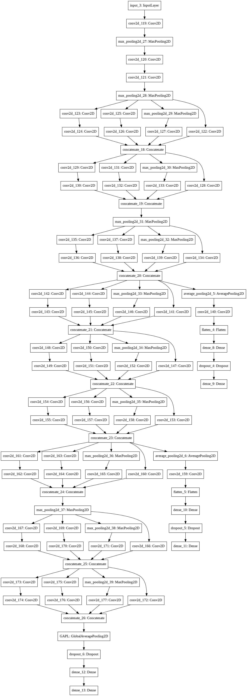

### Inception-V1 (GoogLeNet) :

**Paper :** [Going Deeper with Convolutions](https://arxiv.org/pdf/1409.4842.pdf) .

**Authors :** Christian Szegedy, Wei Liu, Yangqing Jia, Pierre Sermanet, Scott Reed, Dragomir Anguelov, Dumitru Erhan, Vincent Vanhoucke, Andrew Rabinovich. Google, University of Michigan, University of North Carolina .

**Published in :** 2015 IEEE Conference on Computer Vision and Pattern Recognition (CVPR) .

**Model Architecture :** 
<div align="center" >

</div>

**keras :**

```python
from keras.models import Model
from keras.layers.merge import concatenate
from keras.layers import Conv2D , MaxPool2D ,AveragePooling2D, Dense , Dropout , Flatten , Input , GlobalAveragePooling2D


def InceptionBlock(previous_layer , nbr_f1 , nbr_f2_1 , nbr_f2_2 , nbr_f3_1 , nbr_f3_2 , nbr_f4) :
    
    #Path 1
    path1 = Conv2D(filters=nbr_f1, kernel_size = (1,1), padding='same' , activation='relu')(previous_layer)
    
    #Path 2 
    path2 = Conv2D(filters=nbr_f2_1, kernel_size = (1,1), padding='same' , activation='relu')(previous_layer)
    path2 = Conv2D(filters=nbr_f2_2, kernel_size = (3,3), padding='same' , activation='relu')(path2)
    
    #Path 3
    path3 = Conv2D(filters=nbr_f3_1, kernel_size = (1,1), padding='same' , activation='relu')(previous_layer)
    path3 = Conv2D(filters=nbr_f3_1, kernel_size = (5,5), padding='same' , activation='relu')(path3)
    
    #Path 4
    path4 = MaxPool2D(pool_size=(3,3) , strides=(1,1) , padding='same') (previous_layer)
    path4 = Conv2D(filters=nbr_f4, kernel_size = (1,1), padding='same' , activation='relu')(path4)
    
    output_Layer = concatenate([path1 , path2 , path3 , path4], axis = -1)
    
    return output_Layer

def InceptionV1():
    input_layer = Input(shape = (224, 224, 3))
    x1 = Conv2D(filters = 64, kernel_size = (7,7), strides=2 , padding='valid' , activation='relu' )(input_layer)
    x1 = MaxPool2D(pool_size=(3,3) , strides=2 )(x1)
    x1 = Conv2D(filters = 64, kernel_size = (1,1), strides=1 , padding='same' , activation='relu' )(x1)
    x1 = Conv2D(filters = 192, kernel_size = (3,3), strides=1 , padding='same' , activation='relu' )(x1)
    x1 = MaxPool2D(pool_size=(3,3) , strides=2 )(x1)
    x1 = InceptionBlock(previous_layer=x1, nbr_f1=64, nbr_f2_1=96, nbr_f2_2=128, nbr_f3_1=16, nbr_f3_2=32, nbr_f4=32)
    x1 = InceptionBlock(previous_layer=x1, nbr_f1=128, nbr_f2_1=128, nbr_f2_2=192, nbr_f3_1=32, nbr_f3_2=96, nbr_f4=64)
    x1 = MaxPool2D(pool_size=(3,3) , strides=2 )(x1)
    x1 = InceptionBlock(previous_layer=x1, nbr_f1=192, nbr_f2_1=96, nbr_f2_2=208, nbr_f3_1=16, nbr_f3_2=48, nbr_f4=64)
    
    x2 = AveragePooling2D(pool_size = (5,5), strides = 3)(x1)
    x2 = Conv2D(filters = 128, kernel_size = (1,1), padding = 'same', activation = 'relu')(x2)
    x2 = Flatten()(x2)
    x2 = Dense(1024, activation = 'relu')(x2)
    x2 = Dropout(0.7)(x2)
    x2 = Dense(5, activation = 'softmax')(x2)
    
    x1 = InceptionBlock(previous_layer=x1, nbr_f1=160, nbr_f2_1=112, nbr_f2_2=224, nbr_f3_1=24, nbr_f3_2=64, nbr_f4=64)
    x1 = InceptionBlock(previous_layer=x1, nbr_f1=128, nbr_f2_1=128, nbr_f2_2=256, nbr_f3_1=24, nbr_f3_2=64, nbr_f4=64)
    x1 = InceptionBlock(previous_layer=x1, nbr_f1=112, nbr_f2_1=144, nbr_f2_2=288, nbr_f3_1=32, nbr_f3_2=64, nbr_f4=64)
    
    x3 = AveragePooling2D(pool_size = (5,5), strides = 3)(x1)
    x3 = Conv2D(filters = 128, kernel_size = (1,1), padding = 'same', activation = 'relu')(x3)
    x3 = Flatten()(x3)
    x3 = Dense(1024, activation = 'relu')(x3)
    x3 = Dropout(0.7)(x3)
    x3 = Dense(5, activation = 'softmax')(x3)
    
    x1 = InceptionBlock(previous_layer=x1, nbr_f1=256, nbr_f2_1=160, nbr_f2_2=320, nbr_f3_1=32, nbr_f3_2=128, nbr_f4=128)
    x1 = MaxPool2D(pool_size=(3,3) , strides=2)(x1)
    x1 = InceptionBlock(previous_layer=x1, nbr_f1=256, nbr_f2_1=160, nbr_f2_2=320, nbr_f3_1=32, nbr_f3_2=128, nbr_f4=128)
    x1 = InceptionBlock(previous_layer=x1, nbr_f1=384, nbr_f2_1=192, nbr_f2_2=384, nbr_f3_1=48, nbr_f3_2=128, nbr_f4=128)
    
    x1 = GlobalAveragePooling2D(name = 'GAPL')(x1)
    x1 = Dropout(0.4)(x1)
    x1 = Dense(units=1000, activation='relu')(x1)
    x1 = Dense(units=1000, activation='softmax')(x1)
    
    model = Model(input_layer, [x1 , x2 , x3] , name='InceptionV1')
    return model

```

**pyTorch :**

```python
import torch.nn as nn
import torch
import torch.nn.functional as F
from torchsummary import summary

class Stem(nn.Module):
  def __init__(self):
    super(Stem , self).__init__()
    self.conv1 = nn.Conv2d(in_channels= 3 , out_channels= 64 ,kernel_size=(7,7) , stride= (2,2) , padding=(3,3))
    self.conv2 = nn.Conv2d(in_channels= 64 , out_channels= 64 ,kernel_size=(1,1) , stride= (1,1), padding=0)
    self.conv3 = nn.Conv2d(in_channels= 64 , out_channels= 192 ,kernel_size=(3,3) , stride= (1,1), padding=(1,1))
    self.maxPool = nn.MaxPool2d(kernel_size=(3,3) , stride=(2,2) , padding=1)
  
  def forward(self , x):
    out = self.conv1(x)
    out = F.relu(out)

    out = self.maxPool(out)
    
    out = self.conv2(out)
    out = F.relu(out)
    
    out = self.conv3(out)
    out = F.relu(out)
    
    out = self.maxPool(out)
    
    return out

class InceptionBlock(nn.Module):
  def __init__(self , nbr_channels ,nbr_kernels):
    super(InceptionBlock , self).__init__()
    k_1 , k_2_1 , k_2_2 , k_3_1 , k_3_2 , k_4 = nbr_kernels

    self.branch1 = nn.Sequential(
        nn.Conv2d(in_channels = nbr_channels , out_channels= k_1 , kernel_size=(1,1) , stride=(1,1)),
        nn.ReLU()
    )

    self.branch2 = nn.Sequential(
        nn.Conv2d(in_channels= nbr_channels , out_channels= k_2_1 , kernel_size= (1,1), stride=(1,1)),
        nn.ReLU(),
        nn.Conv2d(in_channels= k_2_1 , out_channels= k_2_2 , kernel_size= (3,3) , stride=(1,1) , padding=(1,1)),
        nn.ReLU()
    )

    self.branch3 = nn.Sequential(
        nn.Conv2d(in_channels= nbr_channels , out_channels= k_3_1 , kernel_size= (1,1) , stride=(1,1)),
        nn.ReLU(),
        nn.Conv2d(in_channels= k_3_1 , out_channels= k_3_2 , kernel_size= (5,5),  stride=(1,1) , padding = (2,2)),
        nn.ReLU()
    )

    self.branch4 = nn.Sequential(
        nn.MaxPool2d(kernel_size=(3,3) , stride=(1,1) , padding=(1,1)),
        nn.Conv2d(in_channels= nbr_channels , out_channels= k_4 , kernel_size= (1,1), stride=(1,1)),
        nn.ReLU()
    )

  def forward(self , x):
    out1 = self.branch1(x)
    out2 = self.branch2(x)
    out3 = self.branch3(x)
    out4 = self.branch4(x)
    
    return torch.cat([out1 ,out2 , out3 , out4] , 1)    

class GoogleNet(nn.Module):
  def __init__(self):
    super(GoogleNet , self).__init__()
    self.stem = Stem()  # Out 192 chan
    
    # Output Size : 28*28*256
    self.Inception1_1 = InceptionBlock(192,[64 , 96 , 128 , 16 , 32 , 32]) 
    
    # Output Size : 28*28*480
    self.Inception1_2 = InceptionBlock(256,[128 , 128 , 192 , 32 , 96 , 64]) 
    
    # Output Size : 14*14*512
    self.Inception2 = InceptionBlock(480,[192 , 96 , 208 , 16 , 48 , 64]) 

    # Output Size : 14*14*512
    self.Inception3_1 = InceptionBlock(512,[160 , 112 , 224 , 24 , 64 , 64])
    # Output Size : 14*14*512
    self.Inception3_2 = InceptionBlock(512,[128 , 128 , 256 , 24 , 64 , 64])
    # Output Size : 14*14*528
    self.Inception3_3 = InceptionBlock(512,[112 , 144 , 288 , 32 , 64 , 64])

    # Output Size : 14*14*832
    self.Inception4 = InceptionBlock(528,[256 , 160 , 320 , 32 , 128 , 128])


    # Output Size : 7*7*832
    self.Inception5_1 = InceptionBlock(832,[256 , 160 , 320 , 32 , 128 , 128])

    # Output Size : 7*7*1024
    self.Inception5_2 = InceptionBlock(832,[384 , 192 , 384 , 48 , 128 , 128])

    self.maxPool = nn.MaxPool2d(kernel_size=(3,3) , stride=(2,2) , padding=1)
    self.avgPool = nn.AvgPool2d(kernel_size=(7,7) , stride=(1,1))

    self.fc1 = nn.Linear(in_features=1024 , out_features =1000 )
    self.fc2 = nn.Linear(in_features=1000 , out_features =1000 )

    self.auxiliary_classifier_1 = nn.Sequential(
        nn.AvgPool2d(kernel_size=(5,5) , stride=(3,3)),
        nn.Conv2d(in_channels=512 , out_channels=128 , kernel_size=(1,1) , stride=(1,1)),
        nn.ReLU(),
        nn.Linear(in_features = 4, out_features=1024), #Missing This
        nn.ReLU(),
        nn.Linear(in_features=1024 , out_features=1000),
        nn.Softmax()
    )

    self.auxiliary_classifier_2 = nn.Sequential(
        nn.AvgPool2d(kernel_size=(5,5) , stride=(3,3) , padding = (1,1)),
        nn.Conv2d(in_channels=528 , out_channels=128 , kernel_size=(1,1) , stride=(1,1)),
        nn.ReLU(),
        nn.Linear(in_features = 4, out_features=1024), #Missing This
        nn.ReLU(),
        nn.Linear(in_features=1024 , out_features=1000),
        nn.Softmax()
    )     

  def forward(self , x):

    out = self.stem(x)
    
    out = self.Inception1_1(out)
    out = self.Inception1_2(out)

    out = self.maxPool(out)

    out = self.Inception2(out)

    aux1 = self.auxiliary_classifier_1(out)
    
    out = self.Inception3_1(out)
    out = self.Inception3_2(out)
    out = self.Inception3_3(out)

    aux2 = self.auxiliary_classifier_2(out)
    
    out = self.Inception4(out)

    out = self.maxPool(out)

    out = self.Inception5_1(out)
    out = self.Inception5_2(out)
    
    out = self.avgPool(out)

    out = out.reshape(out.shape[0] , -1)
    
    out = self.fc1(out)
    out = F.relu(out)
    out = nn.Dropout(p=0.4)(out)
    out = self.fc2(out)
    out = F.softmax(out)

    return out
```