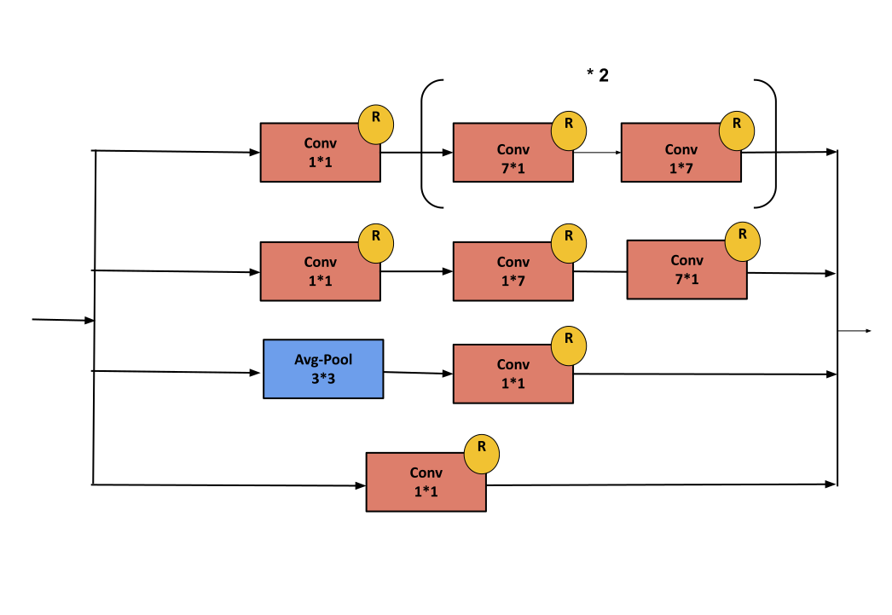

### Inception-V4 :

**Paper :** [Inception-v4, Inception-ResNet and the Impact of Residual Connections on Learning](https://arxiv.org/pdf/1602.07261.pdf).

**Authors :** Christian Szegedy, Sergey Ioffe, Vincent Vanhoucke, Alex Alemi. Google.

**Published in :** Proceedings of the Thirty-First AAAI Conference on Artificial Intelligence .

**Model Architecture :** 

<div align="center" >

</div>

<b>Stem Block : </b>
<div align="center" >

</div>
<b>Inception-A Block : </b>
<div align="center" >

</div>
<b>Inception-B Block : </b>
<div align="center" >

</div>
<b>Inception-C Block : </b>
<div align="center" >

</div>
<b>Reduction-A Block : </b>
<div align="center" >

</div>
<b>Reduction-B Block : </b>
<div align="center" >

</div>
<b>Auxiliary Classifier Block : </b>
<div align="center" >

</div>

**keras :**

```python
from keras.models import Model
from keras.layers.merge import concatenate
from keras.layers import Conv2D , MaxPool2D , Input , GlobalAveragePooling2D ,AveragePooling2D, Dense , Dropout ,Activation , BatchNormalization

def conv2d_with_Batch(prev_layer , nbr_kernels , filter_size , strides = (1,1) , padding = 'valid'):
    x = Conv2D(filters = nbr_kernels, kernel_size = filter_size, strides=strides , padding=padding) (prev_layer)
    x = BatchNormalization()(x)
    x = Activation(activation = 'relu') (x)
    return x

def stemBlock(prev_layer):
    x = conv2d_with_Batch(prev_layer, nbr_kernels = 32, filter_size = (3,3), strides = (2,2))
    x = conv2d_with_Batch(x, nbr_kernels = 32, filter_size = (3,3))
    x = conv2d_with_Batch(x, nbr_kernels = 64, filter_size = (3,3))
    
    x_1 = conv2d_with_Batch(x, nbr_kernels = 96, filter_size = (3,3), strides = (2,2) )
    x_2 = MaxPool2D(pool_size=(3,3) , strides=(2,2) ) (x)
    
    x = concatenate([x_1 , x_2], axis = 3)
    
    x_1 = conv2d_with_Batch(x, nbr_kernels = 64, filter_size = (1,1))
    x_1 = conv2d_with_Batch(x_1, nbr_kernels = 64, filter_size = (1,7) , padding ='same')
    x_1 = conv2d_with_Batch(x_1, nbr_kernels = 64, filter_size = (7,1), padding ='same')
    x_1 = conv2d_with_Batch(x_1, nbr_kernels = 96, filter_size = (3,3))
    
    x_2 = conv2d_with_Batch(x, nbr_kernels = 96, filter_size = (1,1))
    x_2 = conv2d_with_Batch(x_2, nbr_kernels = 96, filter_size = (3,3))
    
    x = concatenate([x_1 , x_2], axis = 3)
    
    x_1 = conv2d_with_Batch(x, nbr_kernels = 192, filter_size = (3,3) , strides=2)
    x_2 = MaxPool2D(pool_size=(3,3) , strides=(2,2) ) (x)
    
    x = concatenate([x_1 , x_2], axis = 3)
    
    return x

def reduction_A_Block(prev_layer) :
    x_1 = conv2d_with_Batch(prev_layer = prev_layer, nbr_kernels = 192, filter_size = (1,1))
    x_1 = conv2d_with_Batch(prev_layer = x_1, nbr_kernels = 224, filter_size = (3,3) , padding='same')
    x_1 = conv2d_with_Batch(prev_layer = x_1, nbr_kernels = 256, filter_size = (3,3) , strides=(2,2)) 
    
    x_2 = conv2d_with_Batch(prev_layer = prev_layer, nbr_kernels = 384, filter_size = (3,3) , strides=(2,2))
    
    x_3 = MaxPool2D(pool_size=(3,3) , strides=(2,2))(prev_layer)
    
    x = concatenate([x_1 , x_2 , x_3], axis = 3)
    
    return x

def reduction_B_Block(prev_layer):
    x_1 = MaxPool2D(pool_size=(3,3) , strides=(2,2))(prev_layer)
    
    x_2 = conv2d_with_Batch(prev_layer = prev_layer, nbr_kernels = 192, filter_size = (1,1))
    x_2 = conv2d_with_Batch(prev_layer = x_2, nbr_kernels = 192, filter_size = (3,3) , strides=(2,2) )
    
    x_3 = conv2d_with_Batch(prev_layer = prev_layer, nbr_kernels = 256, filter_size = (1,1) )
    x_3 = conv2d_with_Batch(prev_layer = x_3, nbr_kernels = 256, filter_size = (1,7) , padding='same')
    x_3 = conv2d_with_Batch(prev_layer = x_3, nbr_kernels = 320, filter_size = (7,1) , padding='same')
    x_3 = conv2d_with_Batch(prev_layer = x_3, nbr_kernels = 320, filter_size = (3,3) , strides=(2,2))
    
    x = concatenate([x_1 , x_2 , x_3], axis = 3)
    return x

def InceptionBlock_A(prev_layer): #I'm Here
    
    x_1 = conv2d_with_Batch(prev_layer = prev_layer, nbr_kernels = 64, filter_size = (1,1))
    x_1 = conv2d_with_Batch(prev_layer = x_1, nbr_kernels = 96, filter_size = (3,3) , strides=(1,1), padding='same' )
    x_1 = conv2d_with_Batch(prev_layer = x_1, nbr_kernels = 96, filter_size = (3,3) , strides=(1,1) , padding='same')
    
    x_2 = conv2d_with_Batch(prev_layer = prev_layer, nbr_kernels = 64, filter_size = (1,1))
    x_2 = conv2d_with_Batch(prev_layer = x_2, nbr_kernels = 96, filter_size = (3,3) , padding='same')
    
    x_3 = AveragePooling2D(pool_size=(3,3) , strides=1 , padding='same')(prev_layer)
    x_3 = conv2d_with_Batch(prev_layer = x_3, nbr_kernels = 96, filter_size = (1,1) , padding='same')
    
    x_4 = conv2d_with_Batch(prev_layer = prev_layer, nbr_kernels = 96, filter_size = (1,1))
    
    output = concatenate([x_1 , x_2 , x_3 , x_4], axis = 3)

    return output
    
def InceptionBlock_B(prev_layer):
    
    x_1 = conv2d_with_Batch(prev_layer = prev_layer, nbr_kernels = 192, filter_size = (1,1))
    x_1 = conv2d_with_Batch(prev_layer = x_1, nbr_kernels = 192, filter_size = (7,1) , padding='same')
    x_1 = conv2d_with_Batch(prev_layer = x_1, nbr_kernels = 224, filter_size = (1,7) , padding='same')
    x_1 = conv2d_with_Batch(prev_layer = x_1, nbr_kernels = 224, filter_size = (7,1) , padding='same')
    x_1 = conv2d_with_Batch(prev_layer = x_1, nbr_kernels = 256, filter_size = (1,7), padding='same')
    
    x_2 = conv2d_with_Batch(prev_layer = prev_layer, nbr_kernels = 192, filter_size = (1,1))
    x_2 = conv2d_with_Batch(prev_layer = x_2, nbr_kernels = 224, filter_size = (1,7) , padding='same')
    x_2 = conv2d_with_Batch(prev_layer = x_2, nbr_kernels = 256, filter_size = (7,1), padding='same')
    
    x_3 = AveragePooling2D(pool_size=(3,3) , strides=1 , padding='same')(prev_layer)
    x_3 = conv2d_with_Batch(prev_layer = x_3, nbr_kernels = 128, filter_size = (1,1))
    
    x_4 = conv2d_with_Batch(prev_layer = prev_layer, nbr_kernels = 384, filter_size = (1,1))

    output = concatenate([x_1 , x_2 ,x_3, x_4], axis = 3) 
    return output


def InceptionBlock_C(prev_layer):
    
    x_1 = conv2d_with_Batch(prev_layer = prev_layer, nbr_kernels = 384, filter_size = (1,1))
    x_1 = conv2d_with_Batch(prev_layer = x_1, nbr_kernels = 448, filter_size = (3,1) , padding='same')
    x_1 = conv2d_with_Batch(prev_layer = x_1, nbr_kernels = 512, filter_size = (1,3) , padding='same')
    x_1_1 = conv2d_with_Batch(prev_layer = x_1, nbr_kernels = 256, filter_size = (1,3), padding='same')
    x_1_2 = conv2d_with_Batch(prev_layer = x_1, nbr_kernels = 256, filter_size = (3,1), padding='same')
    x_1 = concatenate([x_1_1 , x_1_2], axis = 3)
    
    x_2 = conv2d_with_Batch(prev_layer = prev_layer, nbr_kernels = 384, filter_size = (1,1))
    x_2_1 = conv2d_with_Batch(prev_layer = x_2, nbr_kernels = 256, filter_size = (1,3), padding='same')
    x_2_2 = conv2d_with_Batch(prev_layer = x_2, nbr_kernels = 256, filter_size = (3,1), padding='same')
    x_2 = concatenate([x_2_1 , x_2_2], axis = 3)
    
    x_3 = MaxPool2D(pool_size=(3,3),strides = 1 , padding='same')(prev_layer)
    x_3 = conv2d_with_Batch(prev_layer = x_3, nbr_kernels = 256, filter_size = 3  , padding='same')
    
    x_4 = conv2d_with_Batch(prev_layer = prev_layer, nbr_kernels = 256, filter_size = (1,1))
    
    output = concatenate([x_1 , x_2 , x_3 , x_4], axis = 3)
    
    return output


def InceptionV4():
    
    input_layer = Input(shape=(299 , 299 , 3))
    
    x = stemBlock(prev_layer=input_layer)
    
    x = InceptionBlock_A(prev_layer=x)
    x = InceptionBlock_A(prev_layer=x)
    x = InceptionBlock_A(prev_layer=x)
    x = InceptionBlock_A(prev_layer=x)
    
    x = reduction_A_Block(prev_layer=x)
    
    x = InceptionBlock_B(prev_layer=x)
    x = InceptionBlock_B(prev_layer=x)
    x = InceptionBlock_B(prev_layer=x)
    x = InceptionBlock_B(prev_layer=x)
    x = InceptionBlock_B(prev_layer=x)
    x = InceptionBlock_B(prev_layer=x)
    x = InceptionBlock_B(prev_layer=x)
    
    x = reduction_B_Block(prev_layer= x)
    
    x = InceptionBlock_C(prev_layer=x)
    x = InceptionBlock_C(prev_layer=x)
    x = InceptionBlock_C(prev_layer=x)
    
    x = GlobalAveragePooling2D()(x)
    
    x = Dense(units = 1536, activation='relu') (x)
    x = Dropout(rate = 0.8) (x)
    x = Dense(units = 1000, activation='softmax')(x)
    
    model = Model(inputs = input_layer , outputs = x , name ='Inception-V4')
    
    return model

```

**pyTorch :**

```python

import torch.nn as nn
import torch
import torch.nn.functional as F

class conv_Block(nn.Module):
  def __init__(self, in_channels , out_channels , kernel_size , stride , padding):
    super(conv_Block , self).__init__()
    self.conv = nn.Conv2d(in_channels , out_channels , kernel_size , stride , padding)
    self.batchNormalization = nn.BatchNorm2d(out_channels)
    self.activation = nn.ReLU()

  def forward(self,x):
    out = self.conv(x)
    out = self.batchNormalization(out)
    out = self.activation(out)
    return out

class Stem_Block(nn.Module):
  def __init__(self , in_channels):
    super(Stem_Block , self).__init__()
    self.conv1 = conv_Block(in_channels , 32 , 3 , 2 , 0)
    self.conv2 = conv_Block(32 , 32 , 3 , 1 , 0)
    self.conv3 = conv_Block(32 , 64 , 3 , 1 , 1)

    self.branch1 = conv_Block(64 , 96 , 3 , 2 , 0)
    self.branch2 = nn.MaxPool2d(kernel_size=(3,3) , stride=2 , padding=0)

    self.branch1_1 = nn.Sequential(
        conv_Block(160 , 64 , 1 , 1 , 0),
        conv_Block(64 , 64 , (1,7) , 1 , (0,3)),
        conv_Block(64 , 64 , (7,1) , 1 , (3,0)),
        conv_Block(64 , 96 , 3 , 1 , 0)
    )

    self.branch2_1 = nn.Sequential(
        conv_Block(160 , 64 , 1 , 1 , 0),
        conv_Block(64 , 96 , 3 , 1 , 0)
    )

    self.branch1_2 = conv_Block(192 , 192,3 , 2 , 0)

    self.branch2_2 = nn.MaxPool2d(kernel_size=(3,3) , stride=2 , padding=0)


  def forward(self , x):
    out = self.conv1(x)
    out = self.conv2(out)
    out = self.conv3(out)

    branch1 = self.branch1(out)
    branch2 = self.branch2(out)

    out = torch.cat([branch1 , branch2] , 1)

    branch1 = self.branch1_1(out)
    branch2 = self.branch2_1(out)

    out = torch.cat([branch1 , branch2] , 1)  

    branch1 = self.branch1_2(out)
    branch2 = self.branch2_2(out)

    out = torch.cat([branch1 , branch2] , 1)
    return out

class inception_Block_A(nn.Module):
  def __init__(self , in_channels):
    super(inception_Block_A , self).__init__()    
    
    self.branch1 = nn.Sequential(
        conv_Block(in_channels , 64 , 1 , 1 , 0),
        conv_Block(64 , 96 , 3 , 1 , 1),
        conv_Block(96 , 96 , 3 , 1 , 1)
    )
    self.branch2 = nn.Sequential(
        conv_Block(in_channels , 64 , 1 , 1 , 0),
        conv_Block(64 , 96 , 3 , 1 , 1)
    )
    self.branch3 = nn.Sequential(
        nn.MaxPool2d(kernel_size=(3,3) , stride=1 , padding=1),
        conv_Block(in_channels , 96 , 1 ,1 ,0 )
    )
    self.branch4 = conv_Block(in_channels , 96 , 1 , 1 , 0)
  def forward(self , x):

    branch1 = self.branch1(x)
    branch2 = self.branch2(x)
    branch3 = self.branch3(x)
    branch4 = self.branch4(x)

    out = torch.cat([branch1 , branch2 , branch3 , branch4] , 1)
    return out

class inception_Block_B(nn.Module):
  def __init__(self , in_channels):
    super(inception_Block_B , self).__init__()

    self.branch1 = nn.Sequential(
        conv_Block(in_channels , 192 , 1 , 1 , 0),
        conv_Block(192 , 192 , (7,1) , 1 , (3,0)),
        conv_Block(192 , 224 , (1,7) , 1 , (0,3)),
        conv_Block(224 , 224 , (7,1) , 1 , (3,0)),
        conv_Block(224 , 256 , (1,7) , 1 , (0,3)),
    )

    self.branch2 = nn.Sequential(
        conv_Block(in_channels , 192 , 1 , 1 , 0),
        conv_Block(192 , 224 , (1,7) , 1 , (0,3)),
        conv_Block(224 , 256 , (7,1) , 1 , (3,0)),
    )

    self.branch3 = nn.Sequential(
        nn.AvgPool2d(kernel_size=(3,3) , stride=1 , padding=1),
        conv_Block(in_channels , 128 , 1 , 1 , 0)   
    )

    self.branch4 = conv_Block(in_channels , 384 , 1 , 1 , 0)

  def forward(self , x):

    branch1 = self.branch1(x)
    branch2 = self.branch2(x)
    branch3 = self.branch3(x)
    branch4 = self.branch4(x)  

    out = torch.cat([branch1 , branch2 , branch3 , branch4] , 1)

    return out


class inception_Block_C(nn.Module):
  def __init__(self , in_channels):
    super(inception_Block_C , self).__init__()

    self.branch1 = nn.Sequential(
        conv_Block(in_channels , 384 , 1 , 1 , 0),
        conv_Block(384 , 448 , (3,1) , 1 , (1,0)),
        conv_Block(448 , 512 , (1,3) , 1 , (0,1))
    )  

    self.branch1_1 = conv_Block(512 , 256 , (1,3) , 1 , (0,1))
    self.branch1_2 = conv_Block(512 , 256 , (3,1) , 1 , (1,0))

    self.branch2 = conv_Block(in_channels , 384 , 1 , 1 , 0)

    self.branch2_1 = conv_Block(384 , 256 , (1,3) , 1 , (0,1))
    self.branch2_2 = conv_Block(384 , 256 , (3,1) , 1 , (1,0))

    self.branch3 = nn.Sequential(
        nn.MaxPool2d(kernel_size=3 , stride=1 , padding=1),
        conv_Block(in_channels , 256 , 3 , 1 , 1)
    )

    self.branch4 = conv_Block(in_channels , 256 , 1 , 1 , 0)

  def forward(self , x):

    branch1 = self.branch1(x)
    branch1_1 = self.branch1_1(branch1)
    branch1_2 = self.branch1_2(branch1)  
    branch1 = torch.cat([branch1_1 , branch1_2] , 1)

    branch2 = self.branch2(x)
    branch2_1 = self.branch2_1(branch2)
    branch2_2 = self.branch2_2(branch2)
    branch2 = torch.cat([branch2_1 , branch2_2] , 1)

    branch3 = self.branch3(x)

    branch4 = self.branch4(x)

    out = torch.cat([branch1 , branch2 , branch3 , branch4] , 1)

    return out

class reduction_Block_A(nn.Module):
  def __init__(self , in_channels):
    super(reduction_Block_A , self).__init__()

    self.branch1 = nn.Sequential(
        conv_Block(in_channels , 192 , 1 , 1 , 0),
        conv_Block(192 , 224 , 3 , 1 , 1),
        conv_Block(224 , 256 , 3 , 2 , 0)
    )

    self.branch2 = conv_Block(in_channels , 384 , 3 , 2 , 0)

    self.branch3 = nn.MaxPool2d(kernel_size = 3 , stride=2 , padding=0 )

  def forward(self , x):

    branch1 = self.branch1(x)
    branch2 = self.branch2(x)
    branch3 = self.branch3(x)

    out = torch.cat([branch1 ,branch2 , branch3 ] , 1)

    return out

class reduction_Block_B(nn.Module):
  def __init__(self , in_channels):
    super(reduction_Block_B , self).__init__()
    
    self.branch1 = nn.Sequential(
        conv_Block(in_channels , 256 , 1 , 1 , 0),
        conv_Block(256 , 256 , (1,7) , 1 , (0,3)),
        conv_Block(256 , 320 , (7,1) , 1 , (3,0)),
        conv_Block(320 , 320 , 3 , 2 , 0)  
    )

    self.branch2 = nn.Sequential(
        conv_Block(in_channels , 192 , 1 , 1 , 0),
        conv_Block(192 , 192 , 3 , 2 , 0)
    )

    self.branch3 = nn.MaxPool2d(kernel_size=3 , stride=2 , padding=0)

  def forward(self , x):

    branch1 = self.branch1(x)
    branch2 = self.branch2(x)
    branch3 = self.branch3(x)

    out = torch.cat([branch1 , branch2 , branch3] , 1)

    return out

class InceptionV4(nn.Module):
  def __init__(self):
    super(InceptionV4 , self).__init__()

    self.stem = Stem_Block(3)

    self.inceptionA = inception_Block_A(384)

    self.reductionA = reduction_Block_A(384)

    self.inceptionB = inception_Block_B(1024)

    self.reductionB = reduction_Block_B(1024)

    self.inceptionC = inception_Block_C(1536)

    self.fc1 = nn.Linear(in_features=1536 , out_features=1536)
    self.fc2 = nn.Linear(in_features=1536 , out_features=1000)
    self.globalAvgPool = conv_Block(1536 , 1536 , 8 , 1 , 0)

  def forward(self,x):

    out = self.stem(x)
    
    out = self.inceptionA(out)
    out = self.inceptionA(out)
    out = self.inceptionA(out)
    out = self.inceptionA(out)
    
    out = self.reductionA(out)
    

    out = self.inceptionB(out)
    out = self.inceptionB(out)
    out = self.inceptionB(out)
    out = self.inceptionB(out)
    out = self.inceptionB(out)
    out = self.inceptionB(out)
    out = self.inceptionB(out)
    
    out = self.reductionB(out)
    
    out = self.inceptionC(out)
    out = self.inceptionC(out)
    out = self.inceptionC(out)
    
    out = self.globalAvgPool(out)
    
    out = out.reshape(out.shape[0] , -1)

    out = self.fc1(out)
    out = nn.ReLU()(out)

    out = self.fc2(out)
    out = nn.Softmax()(out)
    return out
    
```