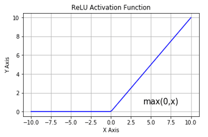

# Convolutional Neural Network From Scratch

This Repository Contains The Explanation and The Implementation Of Convolutional Neural Network Using Keras and Pytorch .

In This Repository you'll see :

* Introduction to CNN .

* Convolutional Neural Network vs Multilayer Perceptron .

* Convolutional Neural Network Layers .
    
    * Kernels or Filters .
    
    * Convolutional layer .
    
    * Activation Layer .
    
    * Pooling Layer .
    
    * Fully Connected Layer .
 
* Different Layers in **Keras** and **pyTorch** . 
* Most Common Architectures of CNN and their Implementation .

* References . 

---
## Introduction :


The Convolutional Neural Network, known as CNN (Convolutional Neural Network), is one of the deep learning algorithms that is the development of the Multilayer Perceptron (MLP) designed to process data in the form of a Matrix (image, sound ...).


Convolutional Neural Networks are used in many fields, but we will just be interested in the application of CNNs to Images.

**The question now is, what is an Image?**

Image is Just a Matrix of Pixels .

<div align="center" >

</div>


**Coding Modes of an Image:**

<div align="center" >

</div>

---
## Convolutional Neural Network vs Multilayer Perceptron :

Imagine with me that we've an Image classification problem to solve , and we've only one choice which is Multilayer Perceptron (Neural Network ) , and The images they have 240 height and 240 width and we're Using RGB.

do you know that we need to build a Neural Network with 240 * 240 * 3 = 172 800 Input which is a very big Neural Network , and it will be very hard for as to train it .

**Can we find a solution that reduces the size of the images and preserves the Characteristics ?**

This is Exactly What CNN Can Do .

<div align="center" >

</div>

In General :

CNN = Convolutional Layers + Activation Layers + Pooling Layers + Fully Connected Layers .

<div align="center" >

</div>

---
## Convolutional Neural Network Layers :

### Kernels or Filters in The Convolutional layer  :

In the convolutional neural network, the Kernel is nothing more than a filter used to extract features from images. The kernel is a matrix that moves over the input data, performs the dot product with the input data subregion, and obtains the output as a dot product matrix. The kernel moves on the input data by the stride value.

<div align="center" >

</div>

There is a lot Kernels , each one is responsible for extracting a specific Feature.

<div align="center" >

</div>

### Convolutional Layers :

The Convolution Layer Extract The Characteristics of The Image By Performing this operation To The Input Image :

<div align="center" >

</div>

The Convolutional Layer produce an Output Image with this Formula :

<div align="center" >

</div>

The Convolutional Layer needs Two Parameters to work :

* Padding :  the amount of pixels added to an image when it is being processed by the kernel of a CNN.
* Stride : Stride is the number of pixels shifts over the input matrix .  


**Example 1 :** Stride = 1 , Padding = 0 :

<div align="center" >

</div>

if we Applied our Formula (In The Picture above) we'll get The Same Result .

```
output width = (input_width - kernel_width + 2 * padding) / stride_width + 1

output height = (input_height - kernel_height + 2 * padding) / stride_height + 1

input Image : 6*6
Kernel Size : 2*2

output width = (6 - 2 + 2 * 0) / 1 + 1 = 5
output height = (6 - 2 + 2 * 0) / 1 + 1 = 5
```

**Example 2 :** Stride = 2 , Padding = 0 :

<div align="center" >

</div>

```
input Image : 6*6
Kernel Size : 2*2

output width = (6 - 2 + 2 * 0) / 2 + 1 = 3
output height = (6 - 2 + 2 * 0) / 2 + 1 = 3
```

**Example 3 :** Stride = 2 , Padding = 1 :

<div align="center" >

</div>

```
input Image : 6*6
Kernel Size : 2*2

output width = (6 - 2 + 2 * 1) / 2 + 1 = 4
output height = (6 - 2 + 2 * 1) / 2 + 1 = 4
```

In All The Examples Above we was talking about Convolution 2D , now let See The general Case which is Convolution 3D :

```
Input Image : W1×H1×D1 .
Number of filters : K (With Size F*F).
the stride  : S .
Padding : P .
Output : 
W2 = (W1−F+2P)/S+1 .
           H2 = (H1−F+2P)/S+1 .
           D2 = K .

```

<div align="center" >

</div>

---
## Activation Function in The Convolutional layer :

The activation function used in CNN networks is RELU and it is defined as follows:

```
RELU (z) = max (0, z)
```

<div align="center" >

</div>

---
## Pooling Layer :

The Pooling Layer Reduce The Size of The Image , there is two type of Pooling :

* Max Pooling .
* AVG Pooling .

<div align="center" >

</div>

The Output Of The Pooling Layer Can be calculated Using This Formula :

<div align="center" >

</div>

#### Max Pooling :

<div align="center" >

</div>

#### AVG Pooling :

<div align="center" >

</div>

---
## Fully Connected Layer :

fully connected layer it can be seen as one layer of a simple Neural Network .

<div align="center" >

</div>

---
## Different Layers in **Keras** and **pyTorch** : 

### **Keras** :


Keras is an open-source software library that provides a Python interface for artificial neural networks. Keras acts as an interface for the TensorFlow library. 


* Convolution Layer :

```python
tf.keras.layers.Conv2D(
    filters,
    kernel_size,
    strides=(1, 1),
    padding="valid",
    data_format=None,
    dilation_rate=(1, 1),
    groups=1,
    activation=None,
    use_bias=True,
    kernel_initializer="glorot_uniform",
    bias_initializer="zeros",
    kernel_regularizer=None,
    bias_regularizer=None,
    activity_regularizer=None,
    kernel_constraint=None,
    bias_constraint=None,
    **kwargs
)
```


* Activation Layer :

```python
tf.keras.activations.relu(x, alpha=0.0, max_value=None, threshold=0)
```

* Pooling Layer :

    * Max-Pooling :
   
    ```python
    tf.keras.layers.MaxPooling2D(
    pool_size=(2, 2), strides=None, padding="valid", data_format=None, **kwargs
    )
    ```
    
    * Avg-Pooling :
    
    ```python
    tf.keras.layers.AveragePooling2D(
    pool_size=(2, 2), strides=None, padding="valid", data_format=None, **kwargs
    )
    ```
* Dropout Layer :

```python
tf.keras.layers.Dropout(rate, noise_shape=None, seed=None, **kwargs)
```

* Dense Layer or Fully Connected Layer :

```python
tf.keras.layers.Dense(
    units,
    activation=None,
    use_bias=True,
    kernel_initializer="glorot_uniform",
    bias_initializer="zeros",
    kernel_regularizer=None,
    bias_regularizer=None,
    activity_regularizer=None,
    kernel_constraint=None,
    bias_constraint=None,
    **kwargs
)
```


### **pyTorch** :


PyTorch is an open source machine learning library based on the Torch library, used for applications such as computer vision and natural language processing, primarily developed by Facebook's AI Research lab. It is free and open-source software released under the Modified BSD license.


* Convolution Layer :

```python
torch.nn.Conv2d(in_channels, out_channels, kernel_size, stride=1, padding=0, dilation=1, groups=1, bias=True, padding_mode='zeros', device=None, dtype=None)
```


* Activation Layer :

```python
torch.nn.ReLU(inplace=False)
```

* Pooling Layer :

    * Max-Pooling :
   
    ```python
    torch.nn.MaxPool2d(kernel_size, stride=None, padding=0, dilation=1, return_indices=False, ceil_mode=False)
    ```
    
    * Avg-Pooling :
    
    ```python
    torch.nn.AvgPool2d(kernel_size, stride=None, padding=0, ceil_mode=False, count_include_pad=True, divisor_override=None)
    ```

* Dropout Layer :

```python
torch.nn.Dropout(p=0.5, inplace=False)
```

* Dense Layer or Fully Connected Layer :

```python
torch.nn.Linear(in_features, out_features, bias=True, device=None, dtype=None)
```

---
## Most Common Architectures of CNN and their Implementation :

### LeNet-5 :

**Paper :** [Gradient-Based Learning Applied to Document Recognition](http://yann.lecun.com/exdb/publis/pdf/lecun-98.pdf) .

**Authors :** Yann LeCun, Léon Bottou, Yoshua Bengio, and Patrick Haffner .

**Published in:** Proceedings of the IEEE 1998 . 

<div align="center" >

</div>

let Apply our Formulas and see how an input Image with 32 * 32 * 1 size become a Vector with 100 length .

```
Input Image = 32 * 32 * 1 .

Convolution Layer 1 : K = 6 , S = 1 , P = 0 , kernel_size = 5*5.

    Output Width  = (input_width - kernel_width + 2 * padding) / stride + 1 . 
                  = (32 - 5 + 2 * 0) / 1 + 1 = 28 .

    Output Height = (input_height - kernel_height + 2 * padding) / stride + 1 . 
                  = (32 - 5 + 2 * 0) / 1 + 1 = 28 .
    
    Output Depth  = Number of kernels .
                  = 6 .

Pooling Layer 1 : S = 2 , P = 0  , filter_size = 2 * 2.

    Output Width  = (input_width - filter_width) / stride + 1 . 
                  = (28 - 2) / 2 + 1 = 14

    Output Height = (input_height - filter_height) / stride + 1 . 
                  = (28 - 2) / 2 + 1 = 14 

    Output Depth  = The Same Depth .
                  = 6 .

Convolution Layer 2 : K = 16 , S = 1 , P = 0 , kernel_size = 5*5.

    Output Width  = (input_width - kernel_width + 2 * padding) / stride + 1 . 
                  = (14 - 5 + 2 * 0) / 1 + 1 = 10 .

    Output Height = (input_height - kernel_height + 2 * padding) / stride + 1 . 
                  = (14 - 5 + 2 * 0) / 1 + 1 = 10 .

    Output Depth  = 16 .

Pooling Layer 2 : S = 2 , P = 0  , filter_size = 2 * 2.

    Output Width  = (input_width - filter_width) / stride + 1 . 
                  = (10 - 2) / 2 + 1 = 5

    Output Height = (input_height - filter_height) / stride + 1 . 
                  = (10 - 2) / 2 + 1 = 5 

    Output Depth  = 16 .

Flatten Layer : S = 1 , P = 0 , K = 120 , kernel_size = 5*5 .

    Output Width  = (input_width - filter_width) / stride + 1 . 
                  = (5 - 5) / 1 + 1 = 1

    Output Height = (input_height - filter_height) / stride + 1 . 
                  = (5 - 5) / 1 + 1 = 1 

    Output Depth  = 120 .

    Output Vector = Output Width * Output Height * Output Depth .
                  = 1 * 1 * 120 .
                  = 120 .


```

**Model Architecture :** 

<div align="center" >

</div>

**keras :**

```python
import numpy as np
import matplotlib.pyplot as plt
import os
from tensorflow.keras.datasets import mnist
from tensorflow.keras.utils import to_categorical
from tensorflow.keras.models import Sequential
from tensorflow.keras.layers import Conv2D , AveragePooling2D , Dense , Dropout , Flatten
from tensorflow.keras.optimizers import Adam

# Disable TensorFlow Warnings
os.environ['TF_CPP_MIN_LOG_LEVEL'] = '3' 

def load_dataSet():
    (x_train , y_train) , (x_test , y_test) = mnist.load_data()
    
    #Concatenate The Data
    x = np.concatenate((x_train , x_test))
    y = np.concatenate((y_train , y_test))    
    
    #Transform The Images from 28*28 to 32*32
    x = np.pad(x , ((0,0) , (2,2) , (2,2)))
    
    #Reshape The Data
    x = x.reshape((x.shape[0] , 32 , 32 , 1))
    
    #One Hot Encodig
    y = to_categorical(y)
    
    #Normalize The Data
    
    x = x.astype('float32')
    
    x /= 255.0
    
    return x , y

def LeNet5():
    
    model = Sequential()
    
    model.add(Conv2D(filters=6 , kernel_size=(5,5) , strides=(1,1) , activation="tanh" , input_shape=(32 , 32 , 1)))
              
    model.add(AveragePooling2D((2,2)))
    
    model.add(Conv2D(filters=16 , kernel_size=(5,5) , strides=(1,1) , activation="tanh" ))   
                  
    model.add(AveragePooling2D((2,2)))
              
    model.add(Flatten())
    
    model.add(Dense(units=120 , activation="tanh"))
    
    model.add(Dropout(0.2))
    
    model.add(Dense(units=84 , activation="tanh"))
    
    model.add(Dropout(0.2))
    
    model.add(Dense(units=10 , activation="softmax"))
    
    adam = Adam(learning_rate=0.01)
    
    model.compile(optimizer=adam , loss = 'binary_crossentropy'  , metrics=['accuracy'])
    
    return model


def displayAccuracy(history):
    # display The accuracy of our Model
    plt.plot(history.history['accuracy'])
    plt.plot(history.history['val_accuracy'])
    plt.title('model accuracy')
    plt.ylabel('accuracy')
    plt.xlabel('epoch')
    plt.legend(['train', 'test'], loc='upper left')
    plt.show()

def displayLoss(history):
    # dsiplay the loss of our Model
    plt.plot(history.history['loss'])
    plt.plot(history.history['val_loss'])
    plt.title('model loss')
    plt.ylabel('loss')
    plt.xlabel('epoch')
    plt.legend(['train', 'test'], loc='upper left')
    plt.show()

if __name__ == "__main__":
    
    # Load The DataSet
    x , y = load_dataSet()
    
    #Define The Model
    model = LeNet5()
    
    # Train The Model
    history = model.fit(x , y ,validation_split=0.33, epochs=10, batch_size=100)
    
    #display The Model Accuracy
    displayAccuracy(history)
    
    #display The Model Loss
    displayLoss(history)
    
    #display The Model Architecture
    print("The Architecture of The Model is : ")
    print(model.summary())
    
```

**pyTorch :**

```python
from torch.nn import Conv2d , AvgPool2d , Linear , Flatten , Module
import torch.nn.functional as F

class LeNet5(Module):
    
    def __init__(self):
        super(LeNet5, self).__init__()
        self.conv1   = Conv2d(in_channels = 1, out_channels = 6, kernel_size = (5,5) , stride = 1)
        self.conv2   = Conv2d(in_channels = 6, out_channels = 16, kernel_size = (5,5) , stride = 1)
        self.conv3   = Conv2d(in_channels = 16, out_channels = 120, kernel_size = (5,5) , stride = 1)
        self.avgpool = AvgPool2d(kernel_size=2 , stride=2)
        self.fc1     = Linear(in_features = 120, out_features = 84)
        self.fc2     = Linear(in_features = 84, out_features = 10)
        
    def forward(self , x):
        x = self.conv1(x)
        x = F.tanh(x)
        
        x = self.avgpool(x)
        
        x = self.conv2(x)
        x = F.tanh(x)
        
        x = self.avgpool(x)
        
        x = self.conv3(x)
        x = F.tanh(x)
        
        x = x.view(x.shape[0] , -1)
        
        x = self.fc1(x)
        x = F.tanh(x)
        
        x = self.fc2(x)
        x = F.softmax(x , dim=1)
        
        return x
```


### AlexNet :

**Paper :** [ImageNet Classification with Deep Convolutional Neural Networks](https://papers.nips.cc/paper/2012/file/c399862d3b9d6b76c8436e924a68c45b-Paper.pdf) .

**Authors :** Alex Krizhevsky, Ilya Sutskever, Geoffrey Hinton. University of Toronto, Canada.

**Published in :** NeurIPS 2012 .

**Model Architecture :** 

<div align="center" >

</div>

**keras :**

```python
from tensorflow.keras.models import Sequential
from tensorflow.keras.layers import Conv2D , MaxPool2D , Dense , Dropout , Flatten
from tensorflow.keras.optimizers import Adam

def AlexNet() :
    
    model = Sequential()
    
    model.add(Conv2D(filters=96 ,kernel_size=(11,11) , strides=(4,4), padding='valid' , input_shape=(224 , 224 , 3) ,activation='relu'))
    
    model.add(MaxPool2D(pool_size=(3,3) , strides=2))
    
    model.add(Conv2D(filters=256 ,kernel_size=(5,5) , strides=(1,1) , padding='valid',activation='relu'))
    
    model.add(MaxPool2D(pool_size=(3,3), strides=2))
    
    model.add(Conv2D(filters=384 , kernel_size=(3,3), strides=(1,1) ,padding='valid' , activation='relu'))
    
    model.add(Conv2D(filters=384 , kernel_size=(3,3) , strides=(1,1) ,padding='valid', activation='relu'))
    
    model.add(Conv2D(filters=256 , kernel_size=(3,3) , strides=(1,1) ,padding='valid', activation='relu'))
    
    model.add(MaxPool2D(pool_size=(3,3), strides=2))
    
    model.add(Dense(units=4096, activation='relu'))
    
    model.add(Dropout(rate=0.5))
    
    model.add(Dense(units=4096, activation='relu'))
    
    model.add(Dropout(rate=0.5))
    
    model.add(Dense(units=1000 , activation='softmax'))

    return model
```

**pyTorch :**

```python
import torch.nn as nn
import torch.nn.functional as F

class AlexNet(Module):
  def __init__(self):
    super(AlexNet , self).__init__()
    self.conv1 = nn.Conv2d(in_channels=3 , out_channels=96 , kernel_size=(11,11) , padding=(0,0),stride=(4,4))
    self.conv2 = nn.Conv2d(in_channels=96 , out_channels=256 , kernel_size=(5,5) ,padding=(2,2) ,stride=(1,1))
    self.conv3 = nn.Conv2d(in_channels=256 , out_channels=384 , kernel_size=(3,3) ,padding=(1,1),stride=(1,1))
    self.conv4 = nn.Conv2d(in_channels=384 , out_channels=384 , kernel_size=(3,3) ,padding=(1,1),stride=(1,1))
    self.conv5 = nn.Conv2d(in_channels=384 , out_channels=256 , kernel_size=(3,3) ,padding=(1,1),stride=(1,1))

    self.maxPool = MaxPool2d(kernel_size=(3,3) , stride=(2,2))

    self.fc1 = nn.Linear(in_features=6400 ,out_features= 4096)
    self.fc2 = nn.Linear(in_features=4096,out_features= 4096)
    self.fc3 = nn.Linear(in_features=4096,out_features= 1000)

  def forward(self ,x):
    x = self.conv1(x)
    x = F.relu(x)
    
    x = self.maxPool(x)
    
    x = self.conv2(x)
    x = F.relu(x)
    
    x = self.maxPool(x)
    
    x = self.conv3(x)
    x = F.relu(x)
    
    x = self.conv4(x)
    x = F.relu(x)
    
    x = self.conv5(x)
    x = F.relu(x)
    
    x = self.maxPool(x)
    
    x = x.reshape(x.shape[0] , -1)
    
    x = self.fc1(x)
    x = F.relu(x)
    x = nn.Dropout(p = 0.5)(x)

    x = self.fc2(x)
    x = F.relu(x)
    x = nn.Dropout(p = 0.5)(x)

    x = self.fc3(x)
    x = F.softmax(x)

    return x
```
### VGG-16 :

**Paper :** [Very Deep Convolutional Networks for Large-Scale Image Recognition](https://arxiv.org/pdf/1409.1556.pdf)

**Authors :** Karen Simonyan, Andrew Zisserman. University of Oxford, UK.

**Published in :** 2014 .

**Model Architecture :** 

<div align="center" >

</div>

**keras :**

```python
from tensorflow.keras.models import Sequential
from tensorflow.keras.layers import Conv2D , MaxPool2D , Dense , Dropout , Flatten
from tensorflow.keras.optimizers import Adam

def VGG16() :
    
    model = Sequential()
    
    model.add(Conv2D(filters=64 , kernel_size=(3,3) , strides=1 , input_shape=(224,224,3) , activation='relu'))
    
    model.add(Conv2D(filters=64 , kernel_size=(3,3) , strides=1 , activation='relu'))
    
    model.add(MaxPool2D(pool_size=(2,2) , strides=2))

    
    model.add(Conv2D(filters=128 , kernel_size=(3,3) , strides=1 , activation='relu'))
    
    model.add(Conv2D(filters=128 , kernel_size=(3,3) , strides=1 , activation='relu'))
    
    model.add(MaxPool2D(pool_size=(2,2) , strides=2))
     
    
    model.add(Conv2D(filters=256 , kernel_size=(3,3) , strides=1 , activation='relu'))
    
    model.add(Conv2D(filters=256 , kernel_size=(3,3) , strides=1 , activation='relu'))
    
    model.add(Conv2D(filters=256 , kernel_size=(3,3) , strides=1 , activation='relu'))
    
    model.add(MaxPool2D(pool_size=(2,2) , strides=2))
        
    
    model.add(Conv2D(filters=512 , kernel_size=(3,3) , strides=1 , activation='relu'))
    
    model.add(Conv2D(filters=512 , kernel_size=(3,3) , strides=1 , activation='relu'))
    
    model.add(Conv2D(filters=512 , kernel_size=(3,3) , strides=1 , activation='relu'))
    
    model.add(MaxPool2D(pool_size=(2,2) , strides=2))
        
    
    model.add(Conv2D(filters=512 , kernel_size=(3,3) , strides=1 , activation='relu'))
    
    model.add(Conv2D(filters=512 , kernel_size=(3,3) , strides=1 , activation='relu'))
    
    model.add(Conv2D(filters=512 , kernel_size=(3,3) , strides=1 , activation='relu'))
    
    model.add(MaxPool2D(pool_size=(2,2) , strides=2))
    
    
    model.add(Dense(units=4096 , activation='relu'))    
    
    model.add(Dense(units=4096 , activation='relu'))
    
    model.add(Dense(units=1000 , activation='softmax'))
    
    return model
```

**pyTorch :**

```python
import torch.nn as nn
import torch.nn.functional as F

class VGG16(nn.Module):
  
  def __init__(self):

    super(VGG16 , self).__init__()

    self.conv1 = nn.Conv2d(in_channels=3 , out_channels= 64 , kernel_size=(3,3) , stride=(1,1) , padding=(1,1))
    self.conv2 = nn.Conv2d(in_channels=64 , out_channels= 64 , kernel_size=(3,3) , stride=(1,1), padding=(1,1))

    self.conv3 = nn.Conv2d(in_channels=64 , out_channels= 128 , kernel_size=(3,3) , stride=(1,1), padding=(1,1))
    self.conv4 = nn.Conv2d(in_channels=128 , out_channels= 128 , kernel_size=(3,3) , stride=(1,1), padding=(1,1))

    self.conv5 = nn.Conv2d(in_channels=128 , out_channels= 256 , kernel_size=(3,3) , stride=(1,1), padding=(1,1))
    self.conv6 = nn.Conv2d(in_channels=256 , out_channels= 256 , kernel_size=(3,3) , stride=(1,1), padding=(1,1))

    self.conv7 = nn.Conv2d(in_channels=256 , out_channels= 512 , kernel_size=(3,3) , stride=(1,1), padding=(1,1))
    self.conv8 = nn.Conv2d(in_channels=512 , out_channels= 512 , kernel_size=(3,3) , stride=(1,1), padding=(1,1))

    self.maxPool = nn.MaxPool2d(kernel_size=(2,2) , stride=(2,2))

    self.fc1 = nn.Linear(in_features=25088 , out_features=4096)
    self.fc2 = nn.Linear(in_features=4096 , out_features=4096)
    self.fc3 = nn.Linear(in_features=4096 , out_features=1000)

  def forward(self, x):
    # 2 Conv Layer with 64 kernels of size 3*3 and stride = 1
    x = self.conv1(x)
    x = F.relu(x)
    x = self.conv2(x)
    x = F.relu(x)

    #Max Pooling Layer with Kernel size 2*2 and stride = 2
    x = self.maxPool(x)

    # 2 Conv Layer with 128 kernels of size 3*3 and stride = 1
    x = self.conv3(x)
    x = F.relu(x)
    x = self.conv4(x)
    x = F.relu(x)

    #Max Pooling Layer with Kernel size 2*2 and stride = 2
    x = self.maxPool(x)

    # 3 Conv Layer with 256 kernels of size 3*3 and stride = 1
    x = self.conv5(x)
    x = F.relu(x)
    x = self.conv6(x)
    x = F.relu(x)
    x = self.conv6(x)
    x = F.relu(x)

    #Max Pooling Layer with Kernel size 2*2 and stride = 2
    x = self.maxPool(x)

    # 3 Conv Layer with 512 kernels of size 3*3 and stride = 1
    x = self.conv7(x)
    x = F.relu(x)
    x = self.conv8(x)
    x = F.relu(x)
    x = self.conv8(x)
    x = F.relu(x)

    #Max Pooling Layer with Kernel size 2*2 and stride = 2
    x = self.maxPool(x)

    # 3 Conv Layer with 512 kernels of size 3*3 and stride = 1
    x = self.conv8(x)
    x = F.relu(x)
    x = self.conv8(x)
    x = F.relu(x)
    x = self.conv8(x)
    x = F.relu(x)
    
    #Max Pooling Layer with Kernel size 2*2 and stride = 2
    x = self.maxPool(x)
    
    # Convert Matrix of features to Vector 
    x = x.reshape(x.shape[0] , -1)

    # Fully Connected Layer With 4096 Unit
    x = self.fc1(x)
    x = F.relu(x)
    # Fully Connected Layer With 4096 Unit
    x = self.fc2(x)
    x = F.relu(x)
    # Fully Connected Layer With 1000 Unit
    x = self.fc3(x)
    x = F.softmax(x)

    return x
```
### VGG-19 :

**Paper :** [Very Deep Convolutional Networks for Large-Scale Image Recognition](https://arxiv.org/pdf/1409.1556.pdf)

**Authors :** Karen Simonyan, Andrew Zisserman Visual Geometry Group, Department of Engineering Science, University of Oxford . 

**Published in :** 2014 .

**Model Architecture :** 

<div align="center" >

</div>

**Keras :**

```python
from keras.models import Model
from keras.layers import Conv2D , MaxPool2D , Input , Flatten , Dense , Dropout  


def VGG19():
    input_layer = Input(shape=(224 , 224 , 3))
    
    #Block 1
    x = Conv2D(filters = 64, kernel_size = (3,3), padding='same' , activation='relu') (input_layer)
    x = Conv2D(filters = 64, kernel_size = (3,3), padding='same' , activation='relu') (x) 
    x = MaxPool2D(pool_size=(2,2) , strides=(2,2) , padding='same') (x)
    
    #Block 2
    x = Conv2D(filters = 128, kernel_size = (3,3), padding='same' , activation='relu') (x)
    x = Conv2D(filters = 128, kernel_size = (3,3), padding='same' , activation='relu') (x) 
    x = MaxPool2D(pool_size=(2,2) , strides=(2,2) , padding='same') (x)
    
    #Block 3
    x = Conv2D(filters = 256, kernel_size = (3,3), padding='same' , activation='relu') (x)
    x = Conv2D(filters = 256, kernel_size = (3,3), padding='same' , activation='relu') (x)
    x = Conv2D(filters = 256, kernel_size = (3,3), padding='same' , activation='relu') (x)
    x = Conv2D(filters = 256, kernel_size = (3,3), padding='same' , activation='relu') (x)
    x = MaxPool2D(pool_size=(2,2) , strides=(2,2) , padding='same') (x)
    
    #Block 4
    x = Conv2D(filters = 512, kernel_size = (3,3), padding='same' , activation='relu') (x)
    x = Conv2D(filters = 512, kernel_size = (3,3), padding='same' , activation='relu') (x)
    x = Conv2D(filters = 512, kernel_size = (3,3), padding='same' , activation='relu') (x)
    x = Conv2D(filters = 512, kernel_size = (3,3), padding='same' , activation='relu') (x)
    x = MaxPool2D(pool_size=(2,2) , strides=(2,2) , padding='same') (x)
    
    #Block 5
    x = Conv2D(filters = 512, kernel_size = (3,3), padding='same' , activation='relu') (x)
    x = Conv2D(filters = 512, kernel_size = (3,3), padding='same' , activation='relu') (x)
    x = Conv2D(filters = 512, kernel_size = (3,3), padding='same' , activation='relu') (x)
    x = Conv2D(filters = 512, kernel_size = (3,3), padding='same' , activation='relu') (x)
    x = MaxPool2D(pool_size=(2,2) , strides=(2,2) , padding='same') (x)
    
    #Block 6
    x = Flatten()(x)
    x = Dense(units = 4096 , activation='relu') (x)
    x = Dropout(rate = 0.2)(x)
    x = Dense(units = 4096 , activation='relu') (x)
    x = Dropout(rate = 0.2)(x)
    x = Dense(units = 1000 , activation='softmax') (x)
    
    model = Model(inputs = input_layer , outputs = x , name = 'VGG-19')
    return model
```

**pyTorch :**

```python
import torch.nn as nn
import torch.nn.functional as F

class VGG19(nn.Module):
  def __init__(self):
    super(VGG19 , self).__init__()
    self.conv1 = nn.Conv2d(in_channels=3 , out_channels=64 , kernel_size=(3,3), stride=(1,1) , padding=(1,1))
    self.conv2 = nn.Conv2d(in_channels=64 , out_channels=128 , kernel_size=(3,3), stride=(1,1) , padding=(1,1))

    self.conv3 = nn.Conv2d(in_channels=128 , out_channels=128 , kernel_size=(3,3), stride=(1,1) , padding=(1,1))
    self.conv4 = nn.Conv2d(in_channels=128 , out_channels=256 , kernel_size=(3,3), stride=(1,1) , padding=(1,1))
    self.conv5 = nn.Conv2d(in_channels=256 , out_channels=256 , kernel_size=(3,3), stride=(1,1) , padding=(1,1))

    self.conv6 = nn.Conv2d(in_channels=256 , out_channels=512 , kernel_size=(3,3), stride=(1,1) , padding=(1,1))
    self.conv7 = nn.Conv2d(in_channels=512 , out_channels=512 , kernel_size=(3,3), stride=(1,1) , padding=(1,1))

    self.maxPool = nn.MaxPool2d(kernel_size=(2,2) , stride=(2,2))

    self.fc1 = nn.Linear(in_features=25088 , out_features=4096)
    self.fc2 = nn.Linear(in_features=4096 , out_features=4096)
    self.fc3 = nn.Linear(in_features=4096 , out_features=1000)

  def forward(self,x):
    # 2 Conv Layers with 64 kernels of size 3*3  
    x = self.conv1(x)
    x = F.relu(x)
    x = self.conv2(x)
    x = F.relu(x)

    #Max Pooling Layer with kernel size 2*2 and stride 2
    x = self.maxPool(x)

    # 2 Conv Layers with 128 kernels of size 3*3
    x = self.conv3(x)
    x = F.relu(x)
    x = self.conv4(x)
    x = F.relu(x)

    #Max Pooling Layer with kernel size 2*2 and stride 2
    x = self.maxPool(x)

    # 2 Conv Layers with 256 kernels of size 3*3
    x = self.conv5(x)
    x = F.relu(x)
    x = self.conv6(x)
    x = F.relu(x)

    #Max Pooling Layer with kernel size 2*2 and stride 2
    x = self.maxPool(x)

    # 4 Conv Layers with 512 kernels of size 3*3
    x = self.conv7(x)
    x = F.relu(x)
    x = self.conv7(x)
    x = F.relu(x)
    x = self.conv7(x)
    x = F.relu(x)
    x = self.conv7(x)
    x = F.relu(x)

    #Max Pooling Layer with kernel size 2*2 and stride 2
    x = self.maxPool(x)

    # 4 Conv Layers with 512 kernels of size 3*3
    x = self.conv7(x)
    x = F.relu(x)
    x = self.conv7(x)
    x = F.relu(x)
    x = self.conv7(x)
    x = F.relu(x)
    x = self.conv7(x)
    x = F.relu(x)

    #Max Pooling Layer with kernel size 2*2 and stride 2
    x = self.maxPool(x)

    x = x.reshape(x.shape[0] , -1)

    #Fully Connected Layer With 4096 Units  
    x = self.fc1(x)
    x = F.relu(x)

    #Fully Connected Layer With 4096 Units
    x = self.fc2(x)
    x = F.relu(x)

    #Fully Connected Layer With 1000 Units
    x = self.fc3(x)
    x = F.softmax(x)

    return x
```

### Inception-V1 (GoogLeNet) :

**Paper :** [Going Deeper with Convolutions](https://arxiv.org/pdf/1409.4842.pdf) .

**Authors :** Christian Szegedy, Wei Liu, Yangqing Jia, Pierre Sermanet, Scott Reed, Dragomir Anguelov, Dumitru Erhan, Vincent Vanhoucke, Andrew Rabinovich. Google, University of Michigan, University of North Carolina .

**Published in :** 2015 IEEE Conference on Computer Vision and Pattern Recognition (CVPR) .

**Model Architecture :** 
<div align="center" >

</div>

**keras :**

```python
from keras.models import Model
from keras.layers.merge import concatenate
from keras.layers import Conv2D , MaxPool2D ,AveragePooling2D, Dense , Dropout , Flatten , Input , GlobalAveragePooling2D


def InceptionBlock(previous_layer , nbr_f1 , nbr_f2_1 , nbr_f2_2 , nbr_f3_1 , nbr_f3_2 , nbr_f4) :
    
    #Path 1
    path1 = Conv2D(filters=nbr_f1, kernel_size = (1,1), padding='same' , activation='relu')(previous_layer)
    
    #Path 2 
    path2 = Conv2D(filters=nbr_f2_1, kernel_size = (1,1), padding='same' , activation='relu')(previous_layer)
    path2 = Conv2D(filters=nbr_f2_2, kernel_size = (3,3), padding='same' , activation='relu')(path2)
    
    #Path 3
    path3 = Conv2D(filters=nbr_f3_1, kernel_size = (1,1), padding='same' , activation='relu')(previous_layer)
    path3 = Conv2D(filters=nbr_f3_1, kernel_size = (5,5), padding='same' , activation='relu')(path3)
    
    #Path 4
    path4 = MaxPool2D(pool_size=(3,3) , strides=(1,1) , padding='same') (previous_layer)
    path4 = Conv2D(filters=nbr_f4, kernel_size = (1,1), padding='same' , activation='relu')(path4)
    
    output_Layer = concatenate([path1 , path2 , path3 , path4], axis = -1)
    
    return output_Layer

def InceptionV1():
    input_layer = Input(shape = (224, 224, 3))
    x1 = Conv2D(filters = 64, kernel_size = (7,7), strides=2 , padding='valid' , activation='relu' )(input_layer)
    x1 = MaxPool2D(pool_size=(3,3) , strides=2 )(x1)
    x1 = Conv2D(filters = 64, kernel_size = (1,1), strides=1 , padding='same' , activation='relu' )(x1)
    x1 = Conv2D(filters = 192, kernel_size = (3,3), strides=1 , padding='same' , activation='relu' )(x1)
    x1 = MaxPool2D(pool_size=(3,3) , strides=2 )(x1)
    x1 = InceptionBlock(previous_layer=x1, nbr_f1=64, nbr_f2_1=96, nbr_f2_2=128, nbr_f3_1=16, nbr_f3_2=32, nbr_f4=32)
    x1 = InceptionBlock(previous_layer=x1, nbr_f1=128, nbr_f2_1=128, nbr_f2_2=192, nbr_f3_1=32, nbr_f3_2=96, nbr_f4=64)
    x1 = MaxPool2D(pool_size=(3,3) , strides=2 )(x1)
    x1 = InceptionBlock(previous_layer=x1, nbr_f1=192, nbr_f2_1=96, nbr_f2_2=208, nbr_f3_1=16, nbr_f3_2=48, nbr_f4=64)
    
    x2 = AveragePooling2D(pool_size = (5,5), strides = 3)(x1)
    x2 = Conv2D(filters = 128, kernel_size = (1,1), padding = 'same', activation = 'relu')(x2)
    x2 = Flatten()(x2)
    x2 = Dense(1024, activation = 'relu')(x2)
    x2 = Dropout(0.7)(x2)
    x2 = Dense(5, activation = 'softmax')(x2)
    
    x1 = InceptionBlock(previous_layer=x1, nbr_f1=160, nbr_f2_1=112, nbr_f2_2=224, nbr_f3_1=24, nbr_f3_2=64, nbr_f4=64)
    x1 = InceptionBlock(previous_layer=x1, nbr_f1=128, nbr_f2_1=128, nbr_f2_2=256, nbr_f3_1=24, nbr_f3_2=64, nbr_f4=64)
    x1 = InceptionBlock(previous_layer=x1, nbr_f1=112, nbr_f2_1=144, nbr_f2_2=288, nbr_f3_1=32, nbr_f3_2=64, nbr_f4=64)
    
    x3 = AveragePooling2D(pool_size = (5,5), strides = 3)(x1)
    x3 = Conv2D(filters = 128, kernel_size = (1,1), padding = 'same', activation = 'relu')(x3)
    x3 = Flatten()(x3)
    x3 = Dense(1024, activation = 'relu')(x3)
    x3 = Dropout(0.7)(x3)
    x3 = Dense(5, activation = 'softmax')(x3)
    
    x1 = InceptionBlock(previous_layer=x1, nbr_f1=256, nbr_f2_1=160, nbr_f2_2=320, nbr_f3_1=32, nbr_f3_2=128, nbr_f4=128)
    x1 = MaxPool2D(pool_size=(3,3) , strides=2)(x1)
    x1 = InceptionBlock(previous_layer=x1, nbr_f1=256, nbr_f2_1=160, nbr_f2_2=320, nbr_f3_1=32, nbr_f3_2=128, nbr_f4=128)
    x1 = InceptionBlock(previous_layer=x1, nbr_f1=384, nbr_f2_1=192, nbr_f2_2=384, nbr_f3_1=48, nbr_f3_2=128, nbr_f4=128)
    
    x1 = GlobalAveragePooling2D(name = 'GAPL')(x1)
    x1 = Dropout(0.4)(x1)
    x1 = Dense(units=1000, activation='relu')(x1)
    x1 = Dense(units=1000, activation='softmax')(x1)
    
    model = Model(input_layer, [x1 , x2 , x3] , name='InceptionV1')
    return model

```

**pyTorch :**

```python
import torch.nn as nn
import torch
import torch.nn.functional as F
from torchsummary import summary

class Stem(nn.Module):
  def __init__(self):
    super(Stem , self).__init__()
    self.conv1 = nn.Conv2d(in_channels= 3 , out_channels= 64 ,kernel_size=(7,7) , stride= (2,2) , padding=(3,3))
    self.conv2 = nn.Conv2d(in_channels= 64 , out_channels= 64 ,kernel_size=(1,1) , stride= (1,1), padding=0)
    self.conv3 = nn.Conv2d(in_channels= 64 , out_channels= 192 ,kernel_size=(3,3) , stride= (1,1), padding=(1,1))
    self.maxPool = nn.MaxPool2d(kernel_size=(3,3) , stride=(2,2) , padding=1)
  
  def forward(self , x):
    out = self.conv1(x)
    out = F.relu(out)

    out = self.maxPool(out)
    
    out = self.conv2(out)
    out = F.relu(out)
    
    out = self.conv3(out)
    out = F.relu(out)
    
    out = self.maxPool(out)
    
    return out

class InceptionBlock(nn.Module):
  def __init__(self , nbr_channels ,nbr_kernels):
    super(InceptionBlock , self).__init__()
    k_1 , k_2_1 , k_2_2 , k_3_1 , k_3_2 , k_4 = nbr_kernels

    self.branch1 = nn.Sequential(
        nn.Conv2d(in_channels = nbr_channels , out_channels= k_1 , kernel_size=(1,1) , stride=(1,1)),
        nn.ReLU()
    )

    self.branch2 = nn.Sequential(
        nn.Conv2d(in_channels= nbr_channels , out_channels= k_2_1 , kernel_size= (1,1), stride=(1,1)),
        nn.ReLU(),
        nn.Conv2d(in_channels= k_2_1 , out_channels= k_2_2 , kernel_size= (3,3) , stride=(1,1) , padding=(1,1)),
        nn.ReLU()
    )

    self.branch3 = nn.Sequential(
        nn.Conv2d(in_channels= nbr_channels , out_channels= k_3_1 , kernel_size= (1,1) , stride=(1,1)),
        nn.ReLU(),
        nn.Conv2d(in_channels= k_3_1 , out_channels= k_3_2 , kernel_size= (5,5),  stride=(1,1) , padding = (2,2)),
        nn.ReLU()
    )

    self.branch4 = nn.Sequential(
        nn.MaxPool2d(kernel_size=(3,3) , stride=(1,1) , padding=(1,1)),
        nn.Conv2d(in_channels= nbr_channels , out_channels= k_4 , kernel_size= (1,1), stride=(1,1)),
        nn.ReLU()
    )

  def forward(self , x):
    out1 = self.branch1(x)
    out2 = self.branch2(x)
    out3 = self.branch3(x)
    out4 = self.branch4(x)
    
    return torch.cat([out1 ,out2 , out3 , out4] , 1)    

class GoogleNet(nn.Module):
  def __init__(self):
    super(GoogleNet , self).__init__()
    self.stem = Stem()  # Out 192 chan
    
    # Output Size : 28*28*256
    self.Inception1_1 = InceptionBlock(192,[64 , 96 , 128 , 16 , 32 , 32]) 
    
    # Output Size : 28*28*480
    self.Inception1_2 = InceptionBlock(256,[128 , 128 , 192 , 32 , 96 , 64]) 
    
    # Output Size : 14*14*512
    self.Inception2 = InceptionBlock(480,[192 , 96 , 208 , 16 , 48 , 64]) 

    # Output Size : 14*14*512
    self.Inception3_1 = InceptionBlock(512,[160 , 112 , 224 , 24 , 64 , 64])
    # Output Size : 14*14*512
    self.Inception3_2 = InceptionBlock(512,[128 , 128 , 256 , 24 , 64 , 64])
    # Output Size : 14*14*528
    self.Inception3_3 = InceptionBlock(512,[112 , 144 , 288 , 32 , 64 , 64])

    # Output Size : 14*14*832
    self.Inception4 = InceptionBlock(528,[256 , 160 , 320 , 32 , 128 , 128])


    # Output Size : 7*7*832
    self.Inception5_1 = InceptionBlock(832,[256 , 160 , 320 , 32 , 128 , 128])

    # Output Size : 7*7*1024
    self.Inception5_2 = InceptionBlock(832,[384 , 192 , 384 , 48 , 128 , 128])

    self.maxPool = nn.MaxPool2d(kernel_size=(3,3) , stride=(2,2) , padding=1)
    self.avgPool = nn.AvgPool2d(kernel_size=(7,7) , stride=(1,1))

    self.fc1 = nn.Linear(in_features=1024 , out_features =1000 )
    self.fc2 = nn.Linear(in_features=1000 , out_features =1000 )

    self.auxiliary_classifier_1 = nn.Sequential(
        nn.AvgPool2d(kernel_size=(5,5) , stride=(3,3)),
        nn.Conv2d(in_channels=512 , out_channels=128 , kernel_size=(1,1) , stride=(1,1)),
        nn.ReLU(),
        nn.Linear(in_features = 4, out_features=1024), #Missing This
        nn.ReLU(),
        nn.Linear(in_features=1024 , out_features=1000),
        nn.Softmax()
    )

    self.auxiliary_classifier_2 = nn.Sequential(
        nn.AvgPool2d(kernel_size=(5,5) , stride=(3,3) , padding = (1,1)),
        nn.Conv2d(in_channels=528 , out_channels=128 , kernel_size=(1,1) , stride=(1,1)),
        nn.ReLU(),
        nn.Linear(in_features = 4, out_features=1024), #Missing This
        nn.ReLU(),
        nn.Linear(in_features=1024 , out_features=1000),
        nn.Softmax()
    )     

  def forward(self , x):

    out = self.stem(x)
    
    out = self.Inception1_1(out)
    out = self.Inception1_2(out)

    out = self.maxPool(out)

    out = self.Inception2(out)

    aux1 = self.auxiliary_classifier_1(out)
    
    out = self.Inception3_1(out)
    out = self.Inception3_2(out)
    out = self.Inception3_3(out)

    aux2 = self.auxiliary_classifier_2(out)
    
    out = self.Inception4(out)

    out = self.maxPool(out)

    out = self.Inception5_1(out)
    out = self.Inception5_2(out)
    
    out = self.avgPool(out)

    out = out.reshape(out.shape[0] , -1)
    
    out = self.fc1(out)
    out = F.relu(out)
    out = nn.Dropout(p=0.4)(out)
    out = self.fc2(out)
    out = F.softmax(out)

    return out
```

### Inception-V3 :

**Paper :** [Rethinking the Inception Architecture for Computer Vision](https://arxiv.org/pdf/1512.00567.pdf) .

**Authors :** Christian Szegedy, Vincent Vanhoucke, Sergey Ioffe, Jonathon Shlens, Zbigniew Wojna. Google, University College London .

**Published in :** 2016 IEEE Conference on Computer Vision and Pattern Recognition (CVPR) .

**Model Architecture :** 
<div align="center" >

</div>

**keras :**

```python
from keras.models import Model
from keras.layers.merge import concatenate
from keras.layers import Conv2D , MaxPool2D , Input , GlobalAveragePooling2D ,AveragePooling2D, Dense , Dropout ,Activation, Flatten , BatchNormalization


def conv_with_Batch_Normalisation(prev_layer , nbr_kernels , filter_Size , strides =(1,1) , padding = 'same'):
    x = Conv2D(filters=nbr_kernels, kernel_size = filter_Size, strides=strides , padding=padding)(prev_layer)
    x = BatchNormalization(axis=3)(x)
    x = Activation(activation='relu')(x)
    return x

def StemBlock(prev_layer):
    x = conv_with_Batch_Normalisation(prev_layer, nbr_kernels = 32, filter_Size=(3,3) , strides=(2,2))
    x = conv_with_Batch_Normalisation(x, nbr_kernels = 32, filter_Size=(3,3))
    x = conv_with_Batch_Normalisation(x, nbr_kernels = 64, filter_Size=(3,3))
    x = MaxPool2D(pool_size=(3,3) , strides=(2,2)) (x)
    x = conv_with_Batch_Normalisation(x, nbr_kernels = 80, filter_Size=(1,1))
    x = conv_with_Batch_Normalisation(x, nbr_kernels = 192, filter_Size=(3,3))
    x = MaxPool2D(pool_size=(3,3) , strides=(2,2)) (x)
    
    return x    
    

def InceptionBlock_A(prev_layer  , nbr_kernels):
    
    branch1 = conv_with_Batch_Normalisation(prev_layer, nbr_kernels = 64, filter_Size = (1,1))
    branch1 = conv_with_Batch_Normalisation(branch1, nbr_kernels=96, filter_Size=(3,3))
    branch1 = conv_with_Batch_Normalisation(branch1, nbr_kernels=96, filter_Size=(3,3))
    
    branch2 = conv_with_Batch_Normalisation(prev_layer, nbr_kernels=48, filter_Size=(1,1))
    branch2 = conv_with_Batch_Normalisation(branch2, nbr_kernels=64, filter_Size=(3,3)) # may be 3*3
    
    branch3 = AveragePooling2D(pool_size=(3,3) , strides=(1,1) , padding='same') (prev_layer)
    branch3 = conv_with_Batch_Normalisation(branch3, nbr_kernels = nbr_kernels, filter_Size = (1,1))
    
    branch4 = conv_with_Batch_Normalisation(prev_layer, nbr_kernels=64, filter_Size=(1,1))
    
    output = concatenate([branch1 , branch2 , branch3 , branch4], axis=3)
    
    return output


def InceptionBlock_B(prev_layer , nbr_kernels):
    
    branch1 = conv_with_Batch_Normalisation(prev_layer, nbr_kernels = nbr_kernels, filter_Size = (1,1))
    branch1 = conv_with_Batch_Normalisation(branch1, nbr_kernels = nbr_kernels, filter_Size = (7,1))
    branch1 = conv_with_Batch_Normalisation(branch1, nbr_kernels = nbr_kernels, filter_Size = (1,7))
    branch1 = conv_with_Batch_Normalisation(branch1, nbr_kernels = nbr_kernels, filter_Size = (7,1))    
    branch1 = conv_with_Batch_Normalisation(branch1, nbr_kernels = 192, filter_Size = (1,7))
    
    branch2 = conv_with_Batch_Normalisation(prev_layer, nbr_kernels = nbr_kernels, filter_Size = (1,1))
    branch2 = conv_with_Batch_Normalisation(branch2, nbr_kernels = nbr_kernels, filter_Size = (1,7))
    branch2 = conv_with_Batch_Normalisation(branch2, nbr_kernels = 192, filter_Size = (7,1))
    
    branch3 = AveragePooling2D(pool_size=(3,3) , strides=(1,1) , padding ='same') (prev_layer)
    branch3 = conv_with_Batch_Normalisation(branch3, nbr_kernels = 192, filter_Size = (1,1))
    
    branch4 = conv_with_Batch_Normalisation(prev_layer, nbr_kernels = 192, filter_Size = (1,1))
    
    output = concatenate([branch1 , branch2 , branch3 , branch4], axis = 3)
    
    return output    


    
def InceptionBlock_C(prev_layer):
    
    branch1 = conv_with_Batch_Normalisation(prev_layer, nbr_kernels = 448, filter_Size = (1,1))
    branch1 = conv_with_Batch_Normalisation(branch1, nbr_kernels = 384, filter_Size = (3,3))
    branch1_1 = conv_with_Batch_Normalisation(branch1, nbr_kernels = 384, filter_Size = (1,3))    
    branch1_2 = conv_with_Batch_Normalisation(branch1, nbr_kernels = 384, filter_Size = (3,1))
    branch1 = concatenate([branch1_1 , branch1_2], axis = 3)
    
    branch2 = conv_with_Batch_Normalisation(prev_layer, nbr_kernels = 384, filter_Size = (1,1))
    branch2_1 = conv_with_Batch_Normalisation(branch2, nbr_kernels = 384, filter_Size = (1,3))
    branch2_2 = conv_with_Batch_Normalisation(branch2, nbr_kernels = 384, filter_Size = (3,1))
    branch2 = concatenate([branch2_1 , branch2_2], axis = 3)
    
    branch3 = AveragePooling2D(pool_size=(3,3) , strides=(1,1) , padding='same')(prev_layer)
    branch3 = conv_with_Batch_Normalisation(branch3, nbr_kernels = 192, filter_Size = (1,1))
    
    branch4 = conv_with_Batch_Normalisation(prev_layer, nbr_kernels = 320, filter_Size = (1,1))
    
    output = concatenate([branch1 , branch2 , branch3 , branch4], axis = 3)
    
    return output

def ReductionBlock_A(prev_layer):
    
    branch1 = conv_with_Batch_Normalisation(prev_layer, nbr_kernels = 64, filter_Size = (1,1))
    branch1 = conv_with_Batch_Normalisation(branch1, nbr_kernels = 96, filter_Size = (3,3))
    branch1 = conv_with_Batch_Normalisation(branch1, nbr_kernels = 96, filter_Size = (3,3) , strides=(2,2) ) #, padding='valid'
    
    branch2 = conv_with_Batch_Normalisation(prev_layer, nbr_kernels = 384, filter_Size=(3,3) , strides=(2,2) )
    
    branch3 = MaxPool2D(pool_size=(3,3) , strides=(2,2) , padding='same')(prev_layer)
    
    output = concatenate([branch1 , branch2 , branch3], axis = 3)
    
    return output

    

def ReductionBlock_B(prev_layer):
    
    branch1 = conv_with_Batch_Normalisation(prev_layer, nbr_kernels = 192, filter_Size = (1,1))
    branch1 = conv_with_Batch_Normalisation(branch1, nbr_kernels = 192, filter_Size = (1,7))
    branch1 = conv_with_Batch_Normalisation(branch1, nbr_kernels = 192, filter_Size = (7,1))
    branch1 = conv_with_Batch_Normalisation(branch1, nbr_kernels = 192, filter_Size = (3,3) , strides=(2,2) , padding = 'valid')
    
    branch2 = conv_with_Batch_Normalisation(prev_layer, nbr_kernels = 192, filter_Size = (1,1) )
    branch2 = conv_with_Batch_Normalisation(branch2, nbr_kernels = 320, filter_Size = (3,3) , strides=(2,2) , padding='valid' )

    branch3 = MaxPool2D(pool_size=(3,3) , strides=(2,2) )(prev_layer)
    
    output = concatenate([branch1 , branch2 , branch3], axis = 3)
    
    return output

def auxiliary_classifier(prev_Layer):
    x = AveragePooling2D(pool_size=(5,5) , strides=(3,3)) (prev_Layer)
    x = conv_with_Batch_Normalisation(x, nbr_kernels = 128, filter_Size = (1,1))
    x = Flatten()(x)
    x = Dense(units = 768, activation='relu') (x)
    x = Dropout(rate = 0.2) (x)
    x = Dense(units = 1000, activation='softmax') (x)
    return x


def InceptionV3():
    
    input_layer = Input(shape=(299 , 299 , 3))
    
    x = StemBlock(input_layer)
    
    x = InceptionBlock_A(prev_layer = x ,nbr_kernels = 32)
    x = InceptionBlock_A(prev_layer = x ,nbr_kernels = 64)
    x = InceptionBlock_A(prev_layer = x ,nbr_kernels = 64)
    
    x = ReductionBlock_A(prev_layer = x )
    
    x = InceptionBlock_B(prev_layer = x  , nbr_kernels = 128)
    x = InceptionBlock_B(prev_layer = x , nbr_kernels = 160)
    x = InceptionBlock_B(prev_layer = x , nbr_kernels = 160)
    x = InceptionBlock_B(prev_layer = x , nbr_kernels = 192)
    
    Aux = auxiliary_classifier(prev_Layer = x)
    
    x = ReductionBlock_B(prev_layer = x)
    
    x = InceptionBlock_C(prev_layer = x)
    x = InceptionBlock_C(prev_layer = x)
    
    x = GlobalAveragePooling2D()(x)
    x = Dense(units=2048, activation='relu') (x)
    x = Dropout(rate = 0.2) (x)
    x = Dense(units=1000, activation='softmax') (x)
    
    model = Model(inputs = input_layer , outputs = [x , Aux] , name = 'Inception-V3')
    
    return model
```

**pyTorch :**

```python
import torch.nn as nn
import torch
import torch.nn.functional as F
from torchsummary import summary

class ConvolutionBlock(nn.Module):
  def __init__(self , in_channels , out_channels , kernel_size , stride , padding):
    super(ConvolutionBlock , self).__init__()
    self.conv = nn.Conv2d(in_channels , out_channels , kernel_size , stride , padding)
    self.batchNormalization = nn.BatchNorm2d(out_channels)
    self.activation = nn.ReLU()
  def forward(self , x):
    out = self.conv(x)
    out = self.batchNormalization(out)
    out = self.activation(out)
    return out

class StemBlock(nn.Module):
  def __init__(self):
    super(StemBlock , self).__init__()

    self.conv1 = ConvolutionBlock(3,32,3,2,0)
    self.conv2 = ConvolutionBlock(32,32,3,1,0)
    self.conv3 = ConvolutionBlock(32,64,3,1,1)
    self.conv4 = ConvolutionBlock(64,80,3,1,0)
    self.conv5 = ConvolutionBlock(80,192,3,1,0)
    self.maxPool = nn.MaxPool2d(kernel_size=(3,3) , stride=(2,2))

  def forward(self , x):

   out = self.conv1(x)
   out = self.conv2(out)
   out = self.conv3(out)

   out = self.maxPool(out)

   out = self.conv4(out)
   out = self.conv5(out)

   out = self.maxPool(out)
  
   return out


class InceptionBlock_A(nn.Module):
  def __init__(self , in_channels , nbr_kernels):
    super(InceptionBlock_A , self).__init__()

    self.branch1 = nn.Sequential(
        ConvolutionBlock(in_channels , 64 , 1 , 1 , 0),
        ConvolutionBlock(64 , 96 , 3 , 1 , 1),
        ConvolutionBlock(96 , 96 , 3 , 1 , 1)
    )

    self.branch2 = nn.Sequential(
        ConvolutionBlock(in_channels , 48 , 1 , 1 , 0),
        ConvolutionBlock(48 , 64 , 3 , 1 , 1)
    )

    self.branch3 = nn.Sequential(
        nn.AvgPool2d(kernel_size=(3,3) , stride=1 , padding=0),
        ConvolutionBlock(in_channels , nbr_kernels , 1 , 1 , 0)
    )

    self.branch4 = ConvolutionBlock(in_channels , 64 , 1 , 1 , 0)

  def forward(self , x):

    branch1 = self.branch1(x)
    branch2 = self.branch2(x)
    branch3 = self.branch3(x)
    branch4 = self.branch4(x)

    out = torch.cat([branch1 , branch2 , branch3 , branch4] , 1)   

    return out   

class InceptionBlock_B(nn.Module):
  def __init__(self , in_channels , nbr_kernels):
    super(InceptionBlock_B , self).__init__()

    self.branch1 = ConvolutionBlock(in_channels , 192 , 1 , 1 , 0)

    self.branch2 = nn.Sequential(
        ConvolutionBlock(in_channels , nbr_kernels , 1 , 1 , 0),
        ConvolutionBlock(nbr_kernels , nbr_kernels , (1,7) , 1 , (0,3)),
        ConvolutionBlock(nbr_kernels , 192 , (7,1) , 1 , (3,0))
    )

    self.branch3 = nn.Sequential(
        ConvolutionBlock(in_channels , nbr_kernels , 1 , 1 , 0),
        ConvolutionBlock(nbr_kernels , nbr_kernels , (7,1) , 1 , (0,3)),
        ConvolutionBlock(nbr_kernels , nbr_kernels , (1,7) , 1 , (3,0)),
        ConvolutionBlock(nbr_kernels , nbr_kernels , (7,1) , 1 , (0,3)),
        ConvolutionBlock(nbr_kernels , 192 , (1,7) , 1 , (3,0)),
    )

    self.branch4 = nn.Sequential(
        nn.AvgPool2d(kernel_size=(3,3) , stride=1 , padding=1),
        ConvolutionBlock(in_channels , 192 , 1 , 1 , 0)
    )

  def forward(self , x):

   branch1 = self.branch1(x)
   branch2 = self.branch2(x)
   branch3 = self.branch3(x)
   branch4 = self.branch4(x)   

   out = torch.cat([branch1 ,branch2 , branch3 ,branch4 ] , 1)

   return out

class InceptionBlock_C(nn.Module):
  def __init__(self , in_channels):
    super(InceptionBlock_C , self).__init__()

    self.branch1 = ConvolutionBlock(in_channels , 320 , 1 , 1 , 0)

    self.branch2 = nn.Sequential(
        nn.AvgPool2d(kernel_size=(3,3) , stride=1 , padding=1),
        ConvolutionBlock(in_channels , 192 , 1 , 1 , 0)
    )

    self.branch3 = ConvolutionBlock(in_channels , 384 , 1 , 1 , 0)

    branch3_1 = ConvolutionBlock(384 , 384 , (1,3) , 1 , (0,1))

    branch3_2 = ConvolutionBlock(384 , 384 , (3,1) , 1 , (1,0))    

    self.branch4 = nn.Sequential(
        ConvolutionBlock(in_channels , 448 , 1 , 1 , 1),
        ConvolutionBlock(448 , 384 , 3 , 1 , 0)
    )

    branch4_1 = ConvolutionBlock(384 , 384 , (3,1) , 1 , (0,1))
    branch4_2 = ConvolutionBlock(384 , 384 , (1,3) , 1 , (1,0))
 
  def forward(self , x):

   branch1 = self.branch1(x)

   branch2 = self.branch2(x)

   branch3 = self.branch3(x)
   branch3 = torch.cat([self.branch3_1(branch3) , self.branch3_2(branch3)] , 1)

   branch4 = self.branch4(x)
   branch4 = torch.cat([self.branch4_1(branch4) , self.branch4_2(branch4)] , 1)

   out = torch.cat([branch1 , branch2 , branch3 , branch4] , 1)

   return out


class ReductionBlock_A(nn.Module):
  def __init__(self , in_channels):

    super(ReductionBlock_A , self).__init__()

    self.branch1 = nn.Sequential(
        ConvolutionBlock(in_channels , 64 , 1 , 1 , 0),
        ConvolutionBlock(64 , 96 , 3 , 1 , 1),
        ConvolutionBlock(96 , 96 , 3 , 2 , 0)
    )

    self.branch2 = ConvolutionBlock(in_channels , 384 , 3 , 1 , 0)

    self.branch3 = nn.MaxPool2d(kernel_size=(3,3) , stride=2 , padding=0)

  def forward(self , x):

   branch1 = self.branch1(x)
   branch2 = self.branch2(x)
   branch3 = self.branch3(x)

   out = torch.cat([branch1 , branch2 , branch3] , 1)

   return out

class ReductionBlock_B(nn.Module):

  def __init__(self , in_channels):
    super(ReductionBlock_B , self).__init__()

    self.branch1 = nn.Sequential(
        ConvolutionBlock(in_channels , 192 , 1 , 1 , 0),
        ConvolutionBlock(192 , 192 , (1,7) , 1 , (0,3)),
        ConvolutionBlock(192 , 192 , (7,1) , 1 , (3,0)),
        ConvolutionBlock(192 , 192 , 3 , 2 , 0)
    )   

    self.branch2 = nn.Sequential(
        ConvolutionBlock(in_channels , 192 , 1 , 2 , 0),
        ConvolutionBlock(192 , 320 , 3 , 2 , 0)
    )

    self.branch3 = nn.MaxPool2d(kernel_size=(3,3) , stride=2 )

  def forward(self , x):

    branch1 = self.branch1(x)
    branch2 = self.branch2(x)
    branch3 = self.branch3(x)

    out = torch.cat([barnch1 , branch2 , branch3] , 1)

    return out

class Aux_Block(nn.Module):
  
  def __init__(self , in_channels):
    super(Aux_Block , self).__init__()

    self.avgPool = nn.AvgPool2d(kernel_size=(5,5) , stride=3 , padding=0)
    self.conv1 = ConvolutionBlock(in_channels , 128 , 1 , 1 , 0)
    self.conv2 = ConvolutionBlock(128 , 768 , 5 , 1 , 0)
    self.fc1 = nn.Linear(in_features= 768 , out_features= 1024)
    self.fc2 = nn.Linear(in_features= 1024 , out_features= 1000)
  
  def forward(self , x):
    
    out = self.avgPool(x)

    out = self.conv1(out)

    out = self.conv2(out)

    out = torch.flatten(out , 1)

    out = self.fc1(out)
    out = nn.ReLU(out)

    out = self.fc2(out)
    out = nn.Softmax(out)

    return out


class InceptionV3(nn.Module):
  def __init__(self):
    super(InceptionV3 , self).__init__()
    self.stem = StemBlock()

    self.inceptionA_1 = InceptionBlock_A(288 , 32)
    self.inceptionA_2 = InceptionBlock_A(288 , 64)
    self.inceptionA_3 = InceptionBlock_A(288 , 64)

    self.reductionA = ReductionBlock_A(288)

    self.inceptionB_1 = InceptionBlock_B(768 , 128)
    self.inceptionB_2 = InceptionBlock_B(768 , 160)
    self.inceptionB_3 = InceptionBlock_B(768 , 160)
    self.inceptionB_4 = InceptionBlock_B(768 , 192)

    self.aux = Aux_Block(768)

    self.reductionB = ReductionBlock_B(768)

    self.inceptionC_1 = InceptionBlock_C(1280)
    self.inceptionC_2 = InceptionBlock_C(2048)

    self.avgpool = nn.AdaptiveAvgPool2d((1, 1))
    self.fc1 = nn.Linear(in_features=2048 ,out_features= 2048)
    self.fc2 = nn.Linear(in_features=2048 , out_features= 1000)

  def forward(self , x):
    
    out = self.stem(x)

    out = self.inceptionA_1(out)
    out = self.inceptionA_2(out)
    out = self.inceptionA_3(out)

    out = self.reductionA(out)

    out = self.inceptionB_1(out)
    out = self.inceptionB_2(out)
    out = self.inceptionB_3(out)
    out = self.inceptionB_4(out)

    aux = self.aux(out)

    out = self.reductionB(out)

    out = self.inceptionC_1(out)
    out = self.inceptionC_2(out)

    out = self.avgPool(out)
    
    out = self.fc1(out)
    out = nn.ReLU(out)

    out = self.fc2(out)
    out = nn.Softmax(out)

    return out , aux    
```


### Inception-V4 :

**Paper :** [Inception-v4, Inception-ResNet and the Impact of Residual Connections on Learning](https://arxiv.org/pdf/1602.07261.pdf).

**Authors :** Christian Szegedy, Sergey Ioffe, Vincent Vanhoucke, Alex Alemi. Google.

**Published in :** Proceedings of the Thirty-First AAAI Conference on Artificial Intelligence .

**keras :**

```python
from keras.models import Model
from keras.layers.merge import concatenate
from keras.layers import Conv2D , MaxPool2D , Input , GlobalAveragePooling2D ,AveragePooling2D, Dense , Dropout ,Activation , BatchNormalization

def conv2d_with_Batch(prev_layer , nbr_kernels , filter_size , strides = (1,1) , padding = 'same'):
    x = Conv2D(filters = nbr_kernels, kernel_size = filter_size, strides=strides , padding=padding) (prev_layer)
    x = BatchNormalization()(x)
    x = Activation(activation = 'relu') (x)
    return x

def stemBlock(prev_layer):
    x = conv2d_with_Batch(prev_layer, nbr_kernels = 32, filter_size = (3,3), strides = (2,2), padding = 's')
    x = conv2d_with_Batch(x, nbr_kernels = 32, filter_size = (3,3), strides = (2,2), padding = 'valid')
    x = conv2d_with_Batch(x, nbr_kernels = 64, filter_size = (3,3))
    
    x_1 = conv2d_with_Batch(x, nbr_kernels = 96, filter_size = (3,3), strides = (2,2) , padding = 'same')
    x_2 = MaxPool2D(pool_size=(3,3) , strides=(2,2) , padding ='same') (x)
    
    x = concatenate([x_1 , x_2], axis = 3)
    
    x_1 = conv2d_with_Batch(x, nbr_kernels = 64, filter_size = (1,1))
    x_1 = conv2d_with_Batch(x_1, nbr_kernels = 64, filter_size = (1,7))
    x_1 = conv2d_with_Batch(x_1, nbr_kernels = 64, filter_size = (7,1))
    x_1 = conv2d_with_Batch(x_1, nbr_kernels = 96, filter_size = (3,3))
    
    x_2 = conv2d_with_Batch(x, nbr_kernels = 96, filter_size = (1,1))
    x_2 = conv2d_with_Batch(x_2, nbr_kernels = 96, filter_size = (3,3) , padding='valid')
    
    x = concatenate([x_1 , x_2], axis = 3)
    
    x_1 = conv2d_with_Batch(x, nbr_kernels = 192, filter_size = (3,3) ,padding='valid')
    x_2 = MaxPool2D(pool_size=(3,3) , strides=(2,2) , padding = 'same') (x)
    
    x = concatenate([x_1 , x_2], axis = 3)
    
    return x

def reduction_A_Block(prev_layer) :
    x_1 = conv2d_with_Batch(prev_layer = prev_layer, nbr_kernels = 192, filter_size = (1,1))
    x_1 = conv2d_with_Batch(prev_layer = x_1, nbr_kernels = 224, filter_size = (3,3))
    x_1 = conv2d_with_Batch(prev_layer = x_1, nbr_kernels = 256, filter_size = (3,3) , strides=(2,2) , padding='valid')
    
    x_2 = conv2d_with_Batch(prev_layer = prev_layer, nbr_kernels = 384, filter_size = (3,3) , strides=(2,2) , padding='valid')
    
    x_3 = MaxPool2D(pool_size=(3,3) , strides=(2,2) , padding='valid')(prev_layer)
    
    x = concatenate([x_1 , x_2 , x_3], axis = 3)
    
    return x

def reduction_B_Block(prev_layer):
    x_1 = MaxPool2D(pool_size=(3,3) , strides=(2,2) , padding='valid')(prev_layer)
    
    x_2 = conv2d_with_Batch(prev_layer = prev_layer, nbr_kernels = 192, filter_size = (1,1))
    x_2 = conv2d_with_Batch(prev_layer = x_2, nbr_kernels = 192, filter_size = (3,3) , strides=(2,2) , padding='valid')
    
    x_3 = conv2d_with_Batch(prev_layer = prev_layer, nbr_kernels = 256, filter_size = (1,1))
    x_3 = conv2d_with_Batch(prev_layer = x_3, nbr_kernels = 256, filter_size = (1,7))
    x_3 = conv2d_with_Batch(prev_layer = x_3, nbr_kernels = 320, filter_size = (7,1))
    x_3 = conv2d_with_Batch(prev_layer = x_3, nbr_kernels = 320, filter_size = (3,3) , strides=(2,2) , padding='valid')
    
    x = concatenate([x_1 , x_2 , x_3], axis = 3)
    return x

def InceptionBlock_A(prev_layer):
    
    x_1 = conv2d_with_Batch(prev_layer = prev_layer, nbr_kernels = 64, filter_size = (1,1))
    x_1 = conv2d_with_Batch(prev_layer = x_1, nbr_kernels = 96, filter_size = (3,3) , strides=(2,2))
    
    x_2 = conv2d_with_Batch(prev_layer = prev_layer, nbr_kernels = 64, filter_size = (1,1))
    x_2 = conv2d_with_Batch(prev_layer = x_2, nbr_kernels = 96, filter_size = (3,3) )
    
    x_3 = AveragePooling2D(pool_size=(3,3))(prev_layer)
    x_3 = conv2d_with_Batch(prev_layer = x_3, nbr_kernels = 96, filter_size = (1,1))
    
    x_4 = conv2d_with_Batch(prev_layer = prev_layer, nbr_kernels = 96, filter_size = (1,1))
    
    output = concatenate([x_1 , x_2 , x_3 , x_4], axis = 3)

    return output
    
def InceptionBlock_B(prev_layer):
    
    x_1 = conv2d_with_Batch(prev_layer = prev_layer, nbr_kernels = 192, filter_size = (1,1))
    x_1 = conv2d_with_Batch(prev_layer = x_1, nbr_kernels = 192, filter_size = (7,1))
    x_1 = conv2d_with_Batch(prev_layer = x_1, nbr_kernels = 224, filter_size = (1,7))
    x_1 = conv2d_with_Batch(prev_layer = x_1, nbr_kernels = 224, filter_size = (7,1))
    x_1 = conv2d_with_Batch(prev_layer = x_1, nbr_kernels = 256, filter_size = (1,7))
    
    x_2 = conv2d_with_Batch(prev_layer = prev_layer, nbr_kernels = 192, filter_size = (1,1))
    x_2 = conv2d_with_Batch(prev_layer = x_2, nbr_kernels = 224, filter_size = (1,7))
    x_2 = conv2d_with_Batch(prev_layer = x_2, nbr_kernels = 256, filter_size = (7,1))
    
    x_3 = AveragePooling2D(pool_size=(3,3))(prev_layer)
    x_3 = conv2d_with_Batch(prev_layer = x_3, nbr_kernels = 128, filter_size = (1,1))
    
    x_4 = conv2d_with_Batch(prev_layer = prev_layer, nbr_kernels = 384, filter_size = (1,1))

    output = concatenate([x_1 , x_2 ,x_3, x_4], axis = 3) 
    return output


def InceptionBlock_C(prev_layer):
    
    x_1 = conv2d_with_Batch(prev_layer = prev_layer, nbr_kernels = 384, filter_size = (1,1))
    x_1 = conv2d_with_Batch(prev_layer = x_1, nbr_kernels = 448, filter_size = (3,1))
    x_1 = conv2d_with_Batch(prev_layer = x_1, nbr_kernels = 512, filter_size = (1,3))
    x_1_1 = conv2d_with_Batch(prev_layer = x_1, nbr_kernels = 256, filter_size = (1,3))
    x_1_2 = conv2d_with_Batch(prev_layer = x_1, nbr_kernels = 256, filter_size = (3,1))
    x_1 = concatenate([x_1_1 , x_1_2], axis = 3)
    
    x_2 = conv2d_with_Batch(prev_layer = prev_layer, nbr_kernels = 384, filter_size = (1,1))
    x_2_1 = conv2d_with_Batch(prev_layer = x_2, nbr_kernels = 256, filter_size = (1,3))
    x_2_2 = conv2d_with_Batch(prev_layer = x_2, nbr_kernels = 256, filter_size = (3,1))
    x_2 = concatenate([x_2_1 , x_2_2], axis = 3)
    
    x_3 = MaxPool2D(pool_size=(3,3))(prev_layer)
    x_3 = conv2d_with_Batch(prev_layer = x_3, nbr_kernels = 256, filter_size = (1,3))
    
    x_4 = conv2d_with_Batch(prev_layer = prev_layer, nbr_kernels = 256, filter_size = (1,1))
    
    output = concatenate([x_1 , x_2 , x_3 , x_4], axis = 3)
    
    return output


def InceptionV4():
    
    input_layer = Input(shape=(299 , 299 , 3))
    
    x = stemBlock(prev_layer=input_layer)
    
    x = InceptionBlock_A(prev_layer=x)
    x = InceptionBlock_A(prev_layer=x)
    x = InceptionBlock_A(prev_layer=x)
    x = InceptionBlock_A(prev_layer=x)
    
    x = reduction_A_Block(prev_layer=x)
    
    x = InceptionBlock_B(prev_layer=x)
    x = InceptionBlock_B(prev_layer=x)
    x = InceptionBlock_B(prev_layer=x)
    x = InceptionBlock_B(prev_layer=x)
    x = InceptionBlock_B(prev_layer=x)
    x = InceptionBlock_B(prev_layer=x)
    x = InceptionBlock_B(prev_layer=x)
    
    x = reduction_B_Block(prev_layer= x)
    
    x = InceptionBlock_C(prev_layer=x)
    x = InceptionBlock_C(prev_layer=x)
    x = InceptionBlock_C(prev_layer=x)
    
    x = GlobalAveragePooling2D()(x)
    
    x = Dense(units = 1536, activation='relu') (x)
    x = Dropout(rate = 0.8) (x)
    x = Dense(units = 1000, activation='softmax')(x)
    
    model = Model(inputs = input_layer , outputs = x , name ='Inception-V4')
    
    return model
```

**pyTorch :**

```python

```

### Inception-ResNet-V2 :

**Paper :** [Inception-v4, Inception-ResNet and the Impact of Residual Connections on Learning](https://arxiv.org/pdf/1602.07261.pdf).

Authors : Christian Szegedy, Sergey Ioffe, Vincent Vanhoucke, Alex Alemi , Google .

**Published in :** Proceedings of the Thirty-First AAAI Conference on Artificial Intelligence .

**keras :**

```python

```

**pyTorch :**

```python

```

### Xception :

**Paper :** [Xception: Deep Learning with Depthwise Separable Convolutions](https://arxiv.org/pdf/1610.02357.pdf).

**Authors :** François Chollet. Google.

**Published in :** 2017 IEEE Conference on Computer Vision and Pattern Recognition (CVPR).

**Model Architecture :** 
<div align="center" >

</div>

**keras :**

```python
from keras.models import Model
from keras.layers.merge import concatenate
from keras.layers import Conv2D , MaxPool2D , SeparableConv2D , Input , GlobalAveragePooling2D , Dense , Dropout ,Activation , BatchNormalization

def conv_2d(prev_layer,nbr_filters , filter_size , strides , activation = False):
    x = Conv2D(filters = nbr_filters, kernel_size = filter_size, strides=strides , padding='same')(prev_layer)
    x = BatchNormalization(axis = 3) (x)
    if activation :
        x = Activation(activation = 'relu') (x)
    return x    

def sep_conv_2d(prev_layer,nbr_filters , filter_size , strides , activation = False):
    x = SeparableConv2D(filters = nbr_filters, kernel_size = filter_size, strides=strides ,padding='same')(prev_layer)
    x = BatchNormalization(axis = 3) (x)
    if activation :
        x = Activation(activation = 'relu') (x)
    return x

def ConvBlockA(prev_layer , nbr_filters, filter_size = (3,3), strides = (1,1)):
    
    branch1 = conv_2d(prev_layer = prev_layer,nbr_filters = nbr_filters, filter_size = (1,1), strides = (2,2))
    
    branch2 = sep_conv_2d(prev_layer = prev_layer, nbr_filters = nbr_filters, filter_size = filter_size, strides = strides , activation=True)
    branch2 = sep_conv_2d(prev_layer = branch2, nbr_filters = nbr_filters, filter_size = filter_size, strides = strides )
    branch2 = MaxPool2D(pool_size=(3,3) , strides=(2,2), padding='same') (branch2)
    
    output = concatenate([branch1 , branch2], axis = 3)
    
    return output

def ConvBlockB(prev_layer ):
    branch1 = prev_layer
    
    branch2 = sep_conv_2d(prev_layer = prev_layer, nbr_filters = 728, filter_size = (3,3), strides = (1,1) , activation=True)
    branch2 = sep_conv_2d(prev_layer = branch2, nbr_filters = 728, filter_size = (3,3), strides = (1,1), activation=True)
    branch2 = sep_conv_2d(prev_layer = branch2, nbr_filters = 728, filter_size = (3,3), strides = (1,1))
    
    output = concatenate([branch1 , branch2], axis = 3)
    
    return output

def ConvBlockC(prev_layer ):
    branch1 = conv_2d(prev_layer = prev_layer, nbr_filters = 1024, filter_size = (1,1), strides = (2,2))
    
    branch2 = sep_conv_2d(prev_layer, nbr_filters = 728, filter_size = (3,3), strides = (1,1) , activation = 'relu')    
    branch2 = sep_conv_2d(prev_layer = branch2, nbr_filters = 1024, filter_size = (3,3), strides = (1,1))
    branch2 = MaxPool2D(pool_size=(3,3) , strides=(2,2) , padding='same')(branch2)
    
    output = concatenate([branch1 , branch2], axis = 3)
    output = sep_conv_2d(prev_layer = output, nbr_filters = 1536, filter_size = (3,3), strides = (1,1) , activation=True)
    output = sep_conv_2d(prev_layer = output, nbr_filters = 2048, filter_size = (3,3), strides = (1,1) , activation=True)
    return output

def Xception():
    
    input_layer = Input(shape=(299 , 299 , 3))
    
    x = conv_2d(input_layer, nbr_filters = 32, filter_size = (3,3), strides = (2,2) , activation=True)
    x = conv_2d(x, nbr_filters = 64, filter_size = (3,3), strides = (1,1) , activation=True)
    
    x = ConvBlockA(prev_layer = x, nbr_filters = 128)
    x = ConvBlockA(prev_layer = x, nbr_filters = 256)
    x = ConvBlockA(prev_layer = x, nbr_filters = 728)
    
    x = ConvBlockB(prev_layer=x)
    x = ConvBlockB(prev_layer=x)
    x = ConvBlockB(prev_layer=x)
    x = ConvBlockB(prev_layer=x)
    x = ConvBlockB(prev_layer=x)
    x = ConvBlockB(prev_layer=x)
    x = ConvBlockB(prev_layer=x)
    x = ConvBlockB(prev_layer=x)
    
    x = ConvBlockC(prev_layer=x)

    x = GlobalAveragePooling2D()(x)
    x = Dense(units = 2048, activation='relu') (x)
    x = Dropout(rate = 0.5) (x)
    x = Dense(units = 1000, activation='softmax') (x)
    
    model = Model(inputs = input_layer, outputs = x , name = 'Xception')
    
    return model
```

**pyTorch :**

```python

```

### ResNet-50 :

**Paper :** [Deep Residual Learning for Image Recognition](https://arxiv.org/pdf/1512.03385.pdf).

**Authors :** Kaiming He, Xiangyu Zhang, Shaoqing Ren, Jian Sun. Microsoft .

**Published in :** 2016 IEEE Conference on Computer Vision and Pattern Recognition (CVPR).

**Model Architecture :** 
<div align="center" >

</div>


**keras :**

```python
from keras.models import Model
from keras.layers.merge import concatenate
from keras.layers import Conv2D , MaxPool2D , Input ,AveragePooling2D, Dense , Dropout ,Activation, Flatten , BatchNormalization , ZeroPadding2D , MaxPooling2D


def IdentityBlock(prev_Layer , filters):
    f1 , f2 , f3 = filters

    x = Conv2D(filters=f1, kernel_size = (1,1) , strides=(1,1), padding='valid')(prev_Layer)
    x = BatchNormalization(axis=3)(x)
    x = Activation(activation='relu')(x)
    
    x = Conv2D(filters=f2, kernel_size = (3,3) , strides=(1,1), padding='same')(x)
    x = BatchNormalization(axis=3)(x)
    x = Activation(activation='relu')(x)
    
    x = Conv2D(filters=f3, kernel_size = (1,1) , strides=(1,1), padding='valid')(x)
    x = BatchNormalization(axis=3)(x)
    x = Activation(activation='relu')(x)
    
    x = concatenate([ x, prev_Layer ], axis=-1)
    x = Activation(activation='relu')(x)
    return x   

def ConvBlock(prev_Layer , filters , strides):
    f1 , f2 , f3 = filters
    
    #Path 1
    x = Conv2D(filters=f1, kernel_size = (1,1) ,padding='valid', strides=strides)(prev_Layer)
    x = BatchNormalization(axis=3)(x)
    x = Activation(activation='relu')(x)
    
    x = Conv2D(filters=f2, kernel_size = (3,3) , padding='same' , strides=(1 ,1))(x)
    x = BatchNormalization(axis=3)(x)
    x = Activation(activation='relu')(x)
    
    x = Conv2D(filters=f3, kernel_size = (1,1), padding='valid' , strides=(1 ,1))(x)
    x = BatchNormalization(axis=3)(x)
    x = Activation(activation='relu')(x)
    
    #Path 2
    
    x2 = Conv2D(filters=f3, kernel_size=(1,1), padding='valid' , strides=strides)(prev_Layer)
    x2 = BatchNormalization(axis=3)(x2)
    
    x = concatenate([x , x2], axis=-1)
    x = Activation(activation='relu')(x)
    return x
 
def ResNet50():
    input_layer = Input(shape = (224, 224, 3))
    #Stage 1
    x = ZeroPadding2D((3, 3))(input_layer)
    x = Conv2D(filters = 64, kernel_size = (7,7), strides=(2,2)) (x)
    x = BatchNormalization(axis=3)(x)
    x = Activation(activation='relu')(x)
    x = MaxPool2D(pool_size=(3,3) , strides=(2,2))(x)
    
    #Stage 2
    x = ConvBlock(prev_Layer=x, filters = [64 , 64 , 256], strides = 1)
    x = IdentityBlock(prev_Layer=x, filters = [64,64,256])
    x = IdentityBlock(prev_Layer=x, filters = [64,64,256])
    
    #Stage 3
    x = ConvBlock(prev_Layer=x, filters = [128 , 128 , 512], strides = 2)
    x = IdentityBlock(prev_Layer=x, filters = [128 , 128 , 512])
    x = IdentityBlock(prev_Layer=x, filters = [128 , 128 , 512])
    x = IdentityBlock(prev_Layer=x, filters = [128 , 128 , 512])

    #Stage 4    
    x = ConvBlock(prev_Layer=x, filters = [256 , 256 , 1024], strides = 2)    
    x = IdentityBlock(prev_Layer=x, filters = [256 , 265 , 1024])
    x = IdentityBlock(prev_Layer=x, filters = [256 , 265 , 1024])
    x = IdentityBlock(prev_Layer=x, filters = [256 , 265 , 1024])
    x = IdentityBlock(prev_Layer=x, filters = [256 , 265 , 1024])
    x = IdentityBlock(prev_Layer=x, filters = [256 , 265 , 1024])
    
    #Stage 5
    x = ConvBlock(prev_Layer=x, filters = [512 , 512 , 2048], strides = 2)
    x = IdentityBlock(prev_Layer=x, filters = [512 , 512 , 2048])
    x = IdentityBlock(prev_Layer=x, filters = [512 , 512 , 2048])
    
    #Stage 6
    x = AveragePooling2D(pool_size=(7,7)) (x)
    
    x = Flatten()(x)
    x = Dense(units=1000, activation='softmax')(x)
    
    model = Model(inputs=input_layer , outputs = x , name='ResNet50')
    return model
```

**pyTorch :**

```python

```

### ResNext-50 :

**Paper :** [Aggregated Residual Transformations for Deep Neural Networks](https://arxiv.org/pdf/1611.05431.pdf).

**Authors :** Saining Xie, Ross Girshick, Piotr Dollár, Zhuowen Tu, Kaiming He. University of California San Diego, Facebook Research .

**Published in :** 2017 IEEE Conference on Computer Vision and Pattern Recognition (CVPR) .

**Model Architecture :** 
ResNext Architecture it an improvement to ResNet Architecture , The Difference Between Them is in The Figure bellow  .

<div align="center" >

</div>


**keras :**

```python
from keras.models import Model
from keras.layers import Conv2D , MaxPool2D , ZeroPadding2D, Input ,AveragePooling2D, Dense , Dropout ,Activation, Flatten , BatchNormalization
from keras.layers import Add

def IdentityBlock(prev_Layer , filters):
    
    f1 , f2 ,f3 = filters
    block = []
    
    for i in range(32):
        x = Conv2D(filters=f1, kernel_size = (1,1) , strides=(1,1), padding='valid')(prev_Layer)
        x = BatchNormalization(axis=3)(x)
        x = Activation(activation='relu')(x)
        
        x = Conv2D(filters=f2, kernel_size = (3,3) , strides=(1,1), padding='same')(x)
        x = BatchNormalization(axis=3)(x)
        x = Activation(activation='relu')(x)
        
        x = Conv2D(filters=f3, kernel_size = (1,1) , strides=(1,1), padding='valid')(x)
        x = BatchNormalization(axis=3)(x)
        x = Activation(activation='relu')(x)
        block.append(x)
        
    block.append(prev_Layer)
    x = Add()(block)
    x = Activation(activation='relu')(x)
    
    return x


def ConvBlock(prev_Layer , filters , strides):
    f1 , f2 , f3 = filters
    
    block = []
    
    for i in range(32):
        x = Conv2D(filters=f1, kernel_size = (1,1) ,padding='valid', strides=strides)(prev_Layer)
        x = BatchNormalization(axis=3)(x)
        x = Activation(activation='relu')(x)
        
        x = Conv2D(filters=f2, kernel_size = (3,3) , padding='same' , strides=(1 ,1))(x)
        x = BatchNormalization(axis=3)(x)
        x = Activation(activation='relu')(x)
        
        x = Conv2D(filters=f3, kernel_size = (1,1), padding='valid' , strides=(1 ,1))(x)
        x = BatchNormalization(axis=3)(x)
        x = Activation(activation='relu')(x)
        block.append(x)
    
    x2 = Conv2D(filters=f3, kernel_size=(1,1), padding='valid' , strides=strides)(prev_Layer)
    x2 = BatchNormalization(axis=3)(x2)
    
    block.append(x2)
    x = Add()(block)
    x = Activation(activation='relu')(x)
    return x


def ResNext():
    input_layer = Input(shape = (224, 224, 3))
    #Stage 1
    x = ZeroPadding2D((3, 3))(input_layer)
    x = Conv2D(filters = 64, kernel_size = (7,7), strides=(2,2)) (x)
    x = BatchNormalization(axis=3)(x)
    x = Activation(activation='relu')(x)
    x = MaxPool2D(pool_size=(3,3) , strides=(2,2))(x)
    
    #Stage 2
    x = ConvBlock(prev_Layer=x, filters = [128 , 128 , 256], strides = 1)
    x = IdentityBlock(prev_Layer=x, filters = [128 , 128 , 256])
    x = IdentityBlock(prev_Layer=x, filters = [128 , 128 , 256])
    
    #Stage 3
    x = ConvBlock(prev_Layer=x, filters = [256 , 256 , 512], strides = 2)
    x = IdentityBlock(prev_Layer=x, filters = [256 , 256 , 512])
    x = IdentityBlock(prev_Layer=x, filters = [256 , 256 , 512])
    x = IdentityBlock(prev_Layer=x, filters = [256 , 256 , 512])

    #Stage 4    
    x = ConvBlock(prev_Layer=x, filters = [512 , 512 , 1024], strides = 2)    
    x = IdentityBlock(prev_Layer=x, filters = [512 , 512 , 1024])
    x = IdentityBlock(prev_Layer=x, filters = [512 , 512 , 1024])
    x = IdentityBlock(prev_Layer=x, filters = [512 , 512 , 1024])
    x = IdentityBlock(prev_Layer=x, filters = [512 , 512 , 1024])
    x = IdentityBlock(prev_Layer=x, filters = [512 , 512 , 1024])
    
    #Stage 5
    x = ConvBlock(prev_Layer=x, filters = [1024 , 1024 , 2048], strides = 2)
    x = IdentityBlock(prev_Layer=x, filters = [1024 , 1024 , 2048])
    x = IdentityBlock(prev_Layer=x, filters = [1024 , 1024 , 2048])
    
    #Stage 6
    x = AveragePooling2D(pool_size=(7,7)) (x)
    
    x = Flatten()(x)
    x = Dense(units=1000, activation='softmax')(x)
    
    model = Model(inputs=input_layer , outputs = x , name='ResNet50')
    return model
```

**pyTorch :**

```python

```

---
**References :**

* [Convolutional neural network](https://en.wikipedia.org/wiki/Convolutional_neural_network).

* [Illustrated: 10 CNN Architectures](https://towardsdatascience.com/illustrated-10-cnn-architectures-95d78ace614d).

* [Multilayer perceptron](https://en.wikipedia.org/wiki/Multilayer_perceptron).