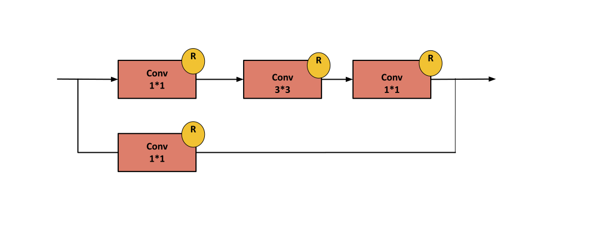

### ResNet-50 :

**Paper :** [Deep Residual Learning for Image Recognition](https://arxiv.org/pdf/1512.03385.pdf).

**Authors :** Kaiming He, Xiangyu Zhang, Shaoqing Ren, Jian Sun. Microsoft .

**Published in :** 2016 IEEE Conference on Computer Vision and Pattern Recognition (CVPR).

**Model Architecture :** 
<div align="center" >

</div>

<b>Conv Block : </b>
<div align="center" >

</div>
<b>Identity Block : </b>
<div align="center" >

</div>


**keras :**

```python
from keras.models import Model
from keras.layers.merge import concatenate
from keras.layers import Conv2D , MaxPool2D , Input ,AveragePooling2D, Dense , Dropout ,Activation, Flatten , BatchNormalization , ZeroPadding2D , MaxPooling2D


def IdentityBlock(prev_Layer , filters):
    f1 , f2 , f3 = filters

    x = Conv2D(filters=f1, kernel_size = (1,1) , strides=(1,1), padding='valid')(prev_Layer)
    x = BatchNormalization(axis=3)(x)
    x = Activation(activation='relu')(x)
    
    x = Conv2D(filters=f2, kernel_size = (3,3) , strides=(1,1), padding='same')(x)
    x = BatchNormalization(axis=3)(x)
    x = Activation(activation='relu')(x)
    
    x = Conv2D(filters=f3, kernel_size = (1,1) , strides=(1,1), padding='valid')(x)
    x = BatchNormalization(axis=3)(x)
    x = Activation(activation='relu')(x)
    
    x = concatenate([ x, prev_Layer ], axis=-1)
    x = Activation(activation='relu')(x)
    return x   

def ConvBlock(prev_Layer , filters , strides):
    f1 , f2 , f3 = filters
    
    #Path 1
    x = Conv2D(filters=f1, kernel_size = (1,1) ,padding='valid', strides=strides)(prev_Layer)
    x = BatchNormalization(axis=3)(x)
    x = Activation(activation='relu')(x)
    
    x = Conv2D(filters=f2, kernel_size = (3,3) , padding='same' , strides=(1 ,1))(x)
    x = BatchNormalization(axis=3)(x)
    x = Activation(activation='relu')(x)
    
    x = Conv2D(filters=f3, kernel_size = (1,1), padding='valid' , strides=(1 ,1))(x)
    x = BatchNormalization(axis=3)(x)
    x = Activation(activation='relu')(x)
    
    #Path 2
    
    x2 = Conv2D(filters=f3, kernel_size=(1,1), padding='valid' , strides=strides)(prev_Layer)
    x2 = BatchNormalization(axis=3)(x2)
    
    x = concatenate([x , x2], axis=-1)
    x = Activation(activation='relu')(x)
    return x
 
def ResNet50():
    input_layer = Input(shape = (224, 224, 3))
    #Stage 1
    x = ZeroPadding2D((3, 3))(input_layer)
    x = Conv2D(filters = 64, kernel_size = (7,7), strides=(2,2)) (x)
    x = BatchNormalization(axis=3)(x)
    x = Activation(activation='relu')(x)
    x = MaxPool2D(pool_size=(3,3) , strides=(2,2))(x)
    
    #Stage 2
    x = ConvBlock(prev_Layer=x, filters = [64 , 64 , 256], strides = 1)
    x = IdentityBlock(prev_Layer=x, filters = [64,64,256])
    x = IdentityBlock(prev_Layer=x, filters = [64,64,256])
    
    #Stage 3
    x = ConvBlock(prev_Layer=x, filters = [128 , 128 , 512], strides = 2)
    x = IdentityBlock(prev_Layer=x, filters = [128 , 128 , 512])
    x = IdentityBlock(prev_Layer=x, filters = [128 , 128 , 512])
    x = IdentityBlock(prev_Layer=x, filters = [128 , 128 , 512])

    #Stage 4    
    x = ConvBlock(prev_Layer=x, filters = [256 , 256 , 1024], strides = 2)    
    x = IdentityBlock(prev_Layer=x, filters = [256 , 265 , 1024])
    x = IdentityBlock(prev_Layer=x, filters = [256 , 265 , 1024])
    x = IdentityBlock(prev_Layer=x, filters = [256 , 265 , 1024])
    x = IdentityBlock(prev_Layer=x, filters = [256 , 265 , 1024])
    x = IdentityBlock(prev_Layer=x, filters = [256 , 265 , 1024])
    
    #Stage 5
    x = ConvBlock(prev_Layer=x, filters = [512 , 512 , 2048], strides = 2)
    x = IdentityBlock(prev_Layer=x, filters = [512 , 512 , 2048])
    x = IdentityBlock(prev_Layer=x, filters = [512 , 512 , 2048])
    
    #Stage 6
    x = AveragePooling2D(pool_size=(7,7)) (x)
    
    x = Flatten()(x)
    x = Dense(units=1000, activation='softmax')(x)
    
    model = Model(inputs=input_layer , outputs = x , name='ResNet50')
    return model
```

**pyTorch :**

```python
import torch
import torch.nn as nn

class convolution2D(nn.Module):
  def __init__(self , in_channels , out_channels , kernel_size , stride , padding , activation):
    super(convolution2D , self).__init__()
    self.conv = nn.Conv2d(in_channels , out_channels , kernel_size , stride , padding)
    self.batchNornalization = nn.BatchNorm2d(num_features=out_channels)
    self.activation = nn.ReLU()
    self.act = activation
  
  def forward(self , x):
    out = self.conv(x)
    out = self.batchNornalization(out)
    if self.act :
      out = self.activation(out)
    return out    

class conv_Block(nn.Module):
  def __init__(self , in_channels , filters , stride):
    super(conv_Block , self).__init__()
    f1 , f2 , f3 = filters

    self.branch1 = nn.Sequential(
        convolution2D(in_channels , f1 , 1 , stride , 0 , True),
        convolution2D(f1 , f2 , 3 , 1 , 1, True),
        convolution2D(f2 , f3 , 1 , 1 , 0, False)
    )

    self.branch2 = convolution2D(in_channels , f3 , 1 , stride , 0, False)
    
    self.activation = nn.ReLU()
  
  def forward(self , x):

    branch1 = self.branch1(x)

    branch2 = self.branch2(x)  

    out = torch.cat([branch1 , branch2] , 1)
    
    return self.activation(out)

class identity_Block(nn.Module):
  def __init__(self , in_channels , filters ):
    super(identity_Block , self).__init__()

    f1 , f2 , f3 = filters
    self.branch1 = nn.Sequential(
        convolution2D(in_channels , f1 , 1 , 1 , 0 , True),
        convolution2D(f1 , f2 , 3 , 1 , 1, True),
        convolution2D(f2 , f3 , 1 , 1 , 0, False)
    )

    self.activation = nn.ReLU()
 
  def forward(self , x):

   branch1 = self.branch1(x)

   branch2 = x

   out = torch.cat([branch1 , branch2] , 1)

   return self.activation(out)

class ResNet_50(nn.Module):
  def __init__(self):
    super(ResNet_50 , self).__init__()
    
    self.conv1 = convolution2D(in_channels = 3 , out_channels = 64, kernel_size = 7 , stride = 2 , padding = 0 , activation = True)
    self.MaxPooling1 = nn.MaxPool2d(kernel_size=3 , stride = 2)

    self.ConvBlock1 = conv_Block(64 , [64, 64,256] , 1)
    self.IdentityBlock1 = identity_Block(512 , [64,64,256])
    self.IdentityBlock2 = identity_Block(768 , [64,64,256])
    self.ConvBlock2 = conv_Block(1024 , [128, 128,512] , 2)
    self.IdentityBlock3 = identity_Block(1024 , [128,128,512])
    self.IdentityBlock4 = identity_Block(1536 , [128,128,512])
    self.IdentityBlock5 = identity_Block(2048 , [128,128,512])
    self.ConvBlock3 = conv_Block(2560 , [256, 256,1024] , 2)
    self.IdentityBlock6 = identity_Block(2048 , [256, 256,1024])
    self.IdentityBlock7 = identity_Block(3072 , [256, 256,1024])
    self.IdentityBlock8 = identity_Block(4096 , [256, 256,1024])
    self.IdentityBlock9 = identity_Block(5120 , [256, 256,1024])
    self.IdentityBlock10 = identity_Block(6144 , [256, 256,1024])
    self.ConvBlock4 = conv_Block(7168 , [512, 512,2048] , 2)
    self.IdentityBlock11 = identity_Block(4096 , [512, 512,2048])
    self.IdentityBlock12 = identity_Block(6144 , [512, 512,2048])
    self.globalAvgPooling = nn.Conv2d(in_channels=8192 , out_channels=8192 , kernel_size=7)
    self.fc = nn.Linear(in_features=8192 , out_features=1000)
    self.activation = nn.Softmax()
 
  def forward(self , x):

    out = self.conv1(x)
    out = self.MaxPooling1(out)
    
    out = self.ConvBlock1(out)
    
    out = self.IdentityBlock1(out)
    out = self.IdentityBlock2(out)
    
    out = self.ConvBlock2(out)
    
    out = self.IdentityBlock3(out)
    out = self.IdentityBlock4(out)
    out = self.IdentityBlock5(out)
    
    out = self.ConvBlock3(out)
    
    out = self.IdentityBlock6(out)
    out = self.IdentityBlock7(out)
    out = self.IdentityBlock8(out)
    out = self.IdentityBlock9(out)
    out = self.IdentityBlock10(out)
    
    out = self.ConvBlock4(out)
    
    out = self.IdentityBlock11(out)
    out = self.IdentityBlock12(out)
    
    out = self.globalAvgPooling(out)
    
    out = out.reshape(out.shape[0] , -1)

    out = self.fc(out)
    out = self.activation(out)

    return out
```