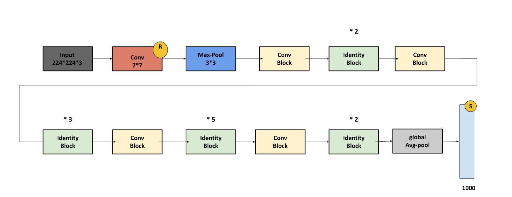
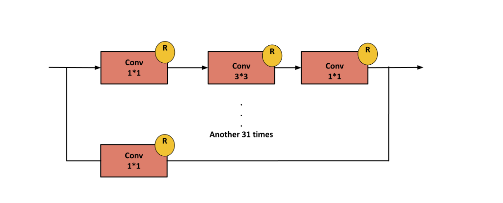
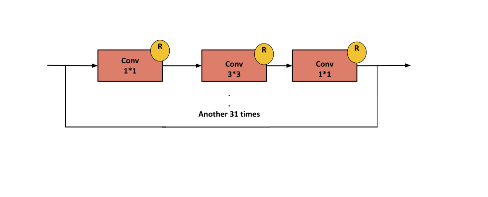

### ResNext-50 :

**Paper :** [Aggregated Residual Transformations for Deep Neural Networks](https://arxiv.org/pdf/1611.05431.pdf).

**Authors :** Saining Xie, Ross Girshick, Piotr Dollár, Zhuowen Tu, Kaiming He. University of California San Diego, Facebook Research .

**Published in :** 2017 IEEE Conference on Computer Vision and Pattern Recognition (CVPR) .

**Model Architecture :** 
ResNext Architecture it an improvement to ResNet Architecture , The Difference Between Them is in The Figure bellow  .

**Model Architecture :** 
<div align="center" >

</div>

<b>Conv Block : </b>
<div align="center" >

</div>

<b>Identity Block : </b>
<div align="center" >

</div>


**keras :**

```python
from keras.models import Model
from keras.layers import Conv2D , MaxPool2D , ZeroPadding2D, Input ,AveragePooling2D, Dense , Dropout ,Activation, Flatten , BatchNormalization
from keras.layers import Add

def IdentityBlock(prev_Layer , filters):
    
    f1 , f2 ,f3 = filters
    block = []
    
    for i in range(32):
        x = Conv2D(filters=f1, kernel_size = (1,1) , strides=(1,1), padding='valid')(prev_Layer)
        x = BatchNormalization(axis=3)(x)
        x = Activation(activation='relu')(x)
        
        x = Conv2D(filters=f2, kernel_size = (3,3) , strides=(1,1), padding='same')(x)
        x = BatchNormalization(axis=3)(x)
        x = Activation(activation='relu')(x)
        
        x = Conv2D(filters=f3, kernel_size = (1,1) , strides=(1,1), padding='valid')(x)
        x = BatchNormalization(axis=3)(x)
        x = Activation(activation='relu')(x)
        block.append(x)
        
    block.append(prev_Layer)
    x = Add()(block)
    x = Activation(activation='relu')(x)
    
    return x


def ConvBlock(prev_Layer , filters , strides):
    f1 , f2 , f3 = filters
    
    block = []
    
    for i in range(32):
        x = Conv2D(filters=f1, kernel_size = (1,1) ,padding='valid', strides=strides)(prev_Layer)
        x = BatchNormalization(axis=3)(x)
        x = Activation(activation='relu')(x)
        
        x = Conv2D(filters=f2, kernel_size = (3,3) , padding='same' , strides=(1 ,1))(x)
        x = BatchNormalization(axis=3)(x)
        x = Activation(activation='relu')(x)
        
        x = Conv2D(filters=f3, kernel_size = (1,1), padding='valid' , strides=(1 ,1))(x)
        x = BatchNormalization(axis=3)(x)
        x = Activation(activation='relu')(x)
        block.append(x)
    
    x2 = Conv2D(filters=f3, kernel_size=(1,1), padding='valid' , strides=strides)(prev_Layer)
    x2 = BatchNormalization(axis=3)(x2)
    
    block.append(x2)
    x = Add()(block)
    x = Activation(activation='relu')(x)
    return x


def ResNext():
    input_layer = Input(shape = (224, 224, 3))
    #Stage 1
    x = ZeroPadding2D((3, 3))(input_layer)
    x = Conv2D(filters = 64, kernel_size = (7,7), strides=(2,2)) (x)
    x = BatchNormalization(axis=3)(x)
    x = Activation(activation='relu')(x)
    x = MaxPool2D(pool_size=(3,3) , strides=(2,2))(x)
    
    #Stage 2
    x = ConvBlock(prev_Layer=x, filters = [128 , 128 , 256], strides = 1)
    x = IdentityBlock(prev_Layer=x, filters = [128 , 128 , 256])
    x = IdentityBlock(prev_Layer=x, filters = [128 , 128 , 256])
    
    #Stage 3
    x = ConvBlock(prev_Layer=x, filters = [256 , 256 , 512], strides = 2)
    x = IdentityBlock(prev_Layer=x, filters = [256 , 256 , 512])
    x = IdentityBlock(prev_Layer=x, filters = [256 , 256 , 512])
    x = IdentityBlock(prev_Layer=x, filters = [256 , 256 , 512])

    #Stage 4    
    x = ConvBlock(prev_Layer=x, filters = [512 , 512 , 1024], strides = 2)    
    x = IdentityBlock(prev_Layer=x, filters = [512 , 512 , 1024])
    x = IdentityBlock(prev_Layer=x, filters = [512 , 512 , 1024])
    x = IdentityBlock(prev_Layer=x, filters = [512 , 512 , 1024])
    x = IdentityBlock(prev_Layer=x, filters = [512 , 512 , 1024])
    x = IdentityBlock(prev_Layer=x, filters = [512 , 512 , 1024])
    
    #Stage 5
    x = ConvBlock(prev_Layer=x, filters = [1024 , 1024 , 2048], strides = 2)
    x = IdentityBlock(prev_Layer=x, filters = [1024 , 1024 , 2048])
    x = IdentityBlock(prev_Layer=x, filters = [1024 , 1024 , 2048])
    
    #Stage 6
    x = AveragePooling2D(pool_size=(7,7)) (x)
    
    x = Flatten()(x)
    x = Dense(units=1000, activation='softmax')(x)
    
    model = Model(inputs=input_layer , outputs = x , name='ResNet50')
    return model
```

**pyTorch :**

```python
import torch
import torch.nn as nn
from torchsummary import summary

class convolution2D(nn.Module):
  def __init__(self , in_channels , out_channels , kernel_size , stride , padding , activation):
    super(convolution2D , self).__init__()
    self.conv = nn.Conv2d(in_channels , out_channels , kernel_size , stride , padding)
    self.batchNornalization = nn.BatchNorm2d(num_features=out_channels)
    self.activation = nn.ReLU()
    self.act = activation
  
  def forward(self , x):
    out = self.conv(x)
    out = self.batchNornalization(out)
    if self.act :
      out = self.activation(out)
    return out

class Conv_Block(nn.Module):
  
  def __init__(self , in_channels , filters , stride):
    super(Conv_Block , self).__init__()
    f1 , f2 , f3 = filters
    
    self.branch1 = nn.Sequential(
        convolution2D(in_channels , f1 , 1 , stride , 0 , True),
        convolution2D(f1 , f2 , 3 , 1 , 1, True),
        convolution2D(f2 , f3 , 1 , 1 , 0, False)
    )

    self.branch2 = convolution2D(in_channels , f3 , 1 , 1 , 0, False)
    self.activation = nn.ReLU()

  def forward(self,x):
    
    paths = [self.branch1(x) for i in range(32)]
    paths.append(self.branch2(x))

    out = torch.cat(paths , 1)
    return self.activation(out)  
    
class Identity_Block(nn.Module):
  
  def __init__(self , in_channels , filters):
    super(Identity_Block , self).__init__()
    f1 , f2 , f3 = filters
    
    self.branch1 = nn.Sequential(
        convolution2D(in_channels , f1 , 1 , 1 , 0 , True),
        convolution2D(f1 , f2 , 3 , 1 , 1, True),
        convolution2D(f2 , f3 , 1 , 1 , 0, False)
    )
    self.activation = nn.ReLU()
  def forward(self , x):
    paths = [self.branch1(x) for i in range(32)]
    paths.append(x)

    out = torch.cat(paths , 1)
    return self.activation(out)

class ResNext_50(nn.Module):
  
  def __init__(self):
    super(ResNext_50,self).__init__()
    self.conv1 = convolution2D(in_channels = 3 , out_channels = 64, kernel_size = 7 , stride = 2 , padding = 0 , activation = True)
    self.MaxPooling1 = nn.MaxPool2d(kernel_size=3 , stride = 2)

    self.convBlock1 = Conv_Block(64 , [128 , 128 , 256] , 1)
    self.IdentityBlock1 = Identity_Block(8448 , [128 , 128 , 256])
    self.IdentityBlock2 = Identity_Block(16640 , [128 , 128 , 256])
    self.convBlock2 = Conv_Block(16896 , [256 , 256 , 512] , 2)
    self.IdentityBlock3 = Identity_Block(33280 , [256 , 256 , 512])
    self.IdentityBlock4 = Identity_Block(49664 , [256 , 256 , 512])
    self.IdentityBlock5 = Identity_Block(66048 , [256 , 256 , 512])
    self.convBlock3 = Conv_Block(33792 , [512 , 512 , 1024] , 2)
    self.IdentityBlock6 = Identity_Block(66560 , [512 , 512 , 1024])
    self.IdentityBlock7 = Identity_Block(99328 , [512 , 512 , 1024])
    self.IdentityBlock8 = Identity_Block(132096 , [512 , 512 , 1024])
    self.IdentityBlock9 = Identity_Block(164864, [512 , 512 , 1024])
    self.IdentityBlock10 = Identity_Block(197632 , [512 , 512 , 1024])
    self.convBlock4 = Conv_Block(67584 , [1024 , 1024 , 2048] , 2)
    self.IdentityBlock11 = Identity_Block(133120, [1024 , 1024 , 2048])
    self.IdentityBlock12 = Identity_Block(192656, [1024 , 1024 , 2048])
    self.globalAvgPooling = nn.Conv2d(in_channels=8192 , out_channels=8192 , kernel_size=7)
    self.fc = nn.Linear(in_features=192656 , out_features=1000)
    self.activation = nn.Softmax()
  def forward(self , x):
    out = self.conv1(x)
    out = self.MaxPooling1(out)

    out = self.convBlock1(out)
    
    out = self.IdentityBlock1(out)
    out = self.IdentityBlock2(out)
    
    out = self.convBlock2(out)
    
    out = self.IdentityBlock3(out)
    out = self.IdentityBlock4(out)
    out = self.IdentityBlock5(out)
    
    out = self.convBlock3(out)
    
    out = self.IdentityBlock6(out)
    out = self.IdentityBlock7(out)
    out = self.IdentityBlock8(out)
    out = self.IdentityBlock9(out)
    out = self.IdentityBlock10(out)
    
    out = self.convBlock4(out)
    
    out = self.IdentityBlock11(out)
    out = self.IdentityBlock12(out)
    
    out = self.globalAvgPooling(out)

    out = out.reshape(out.shape[0] , -1)

    out = self.fc(out)
    out = self.activation(out)
    return out
```
