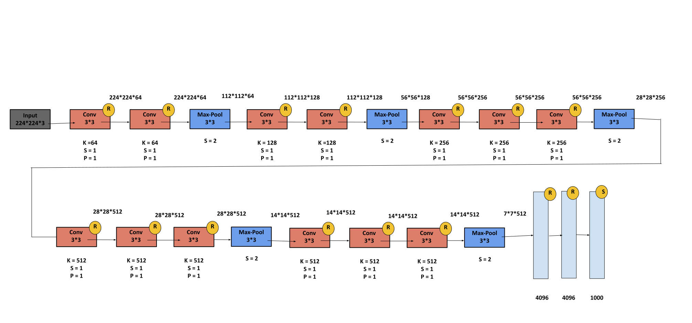

### VGG-16 :

**Paper :** [Very Deep Convolutional Networks for Large-Scale Image Recognition](https://arxiv.org/pdf/1409.1556.pdf)

**Authors :** Karen Simonyan, Andrew Zisserman. University of Oxford, UK.

**Published in :** 2014 .

**Model Architecture :** 

<div align="center" >

</div>

**keras :**

```python
from tensorflow.keras.models import Sequential
from tensorflow.keras.layers import Conv2D , MaxPool2D , Dense , Dropout , Flatten
from tensorflow.keras.optimizers import Adam

def VGG16() :
    
    model = Sequential()
    
    model.add(Conv2D(filters=64 , kernel_size=(3,3) , strides=1 , input_shape=(224,224,3) , activation='relu'))
    
    model.add(Conv2D(filters=64 , kernel_size=(3,3) , strides=1 , activation='relu'))
    
    model.add(MaxPool2D(pool_size=(2,2) , strides=2))

    
    model.add(Conv2D(filters=128 , kernel_size=(3,3) , strides=1 , activation='relu'))
    
    model.add(Conv2D(filters=128 , kernel_size=(3,3) , strides=1 , activation='relu'))
    
    model.add(MaxPool2D(pool_size=(2,2) , strides=2))
     
    
    model.add(Conv2D(filters=256 , kernel_size=(3,3) , strides=1 , activation='relu'))
    
    model.add(Conv2D(filters=256 , kernel_size=(3,3) , strides=1 , activation='relu'))
    
    model.add(Conv2D(filters=256 , kernel_size=(3,3) , strides=1 , activation='relu'))
    
    model.add(MaxPool2D(pool_size=(2,2) , strides=2))
        
    
    model.add(Conv2D(filters=512 , kernel_size=(3,3) , strides=1 , activation='relu'))
    
    model.add(Conv2D(filters=512 , kernel_size=(3,3) , strides=1 , activation='relu'))
    
    model.add(Conv2D(filters=512 , kernel_size=(3,3) , strides=1 , activation='relu'))
    
    model.add(MaxPool2D(pool_size=(2,2) , strides=2))
        
    
    model.add(Conv2D(filters=512 , kernel_size=(3,3) , strides=1 , activation='relu'))
    
    model.add(Conv2D(filters=512 , kernel_size=(3,3) , strides=1 , activation='relu'))
    
    model.add(Conv2D(filters=512 , kernel_size=(3,3) , strides=1 , activation='relu'))
    
    model.add(MaxPool2D(pool_size=(2,2) , strides=2))
    
    
    model.add(Dense(units=4096 , activation='relu'))    
    
    model.add(Dense(units=4096 , activation='relu'))
    
    model.add(Dense(units=1000 , activation='softmax'))
    
    return model
```

**pyTorch :**

```python
import torch.nn as nn
import torch.nn.functional as F

class VGG16(nn.Module):
  
  def __init__(self):

    super(VGG16 , self).__init__()

    self.conv1 = nn.Conv2d(in_channels=3 , out_channels= 64 , kernel_size=(3,3) , stride=(1,1) , padding=(1,1))
    self.conv2 = nn.Conv2d(in_channels=64 , out_channels= 64 , kernel_size=(3,3) , stride=(1,1), padding=(1,1))

    self.conv3 = nn.Conv2d(in_channels=64 , out_channels= 128 , kernel_size=(3,3) , stride=(1,1), padding=(1,1))
    self.conv4 = nn.Conv2d(in_channels=128 , out_channels= 128 , kernel_size=(3,3) , stride=(1,1), padding=(1,1))

    self.conv5 = nn.Conv2d(in_channels=128 , out_channels= 256 , kernel_size=(3,3) , stride=(1,1), padding=(1,1))
    self.conv6 = nn.Conv2d(in_channels=256 , out_channels= 256 , kernel_size=(3,3) , stride=(1,1), padding=(1,1))

    self.conv7 = nn.Conv2d(in_channels=256 , out_channels= 512 , kernel_size=(3,3) , stride=(1,1), padding=(1,1))
    self.conv8 = nn.Conv2d(in_channels=512 , out_channels= 512 , kernel_size=(3,3) , stride=(1,1), padding=(1,1))

    self.maxPool = nn.MaxPool2d(kernel_size=(2,2) , stride=(2,2))

    self.fc1 = nn.Linear(in_features=25088 , out_features=4096)
    self.fc2 = nn.Linear(in_features=4096 , out_features=4096)
    self.fc3 = nn.Linear(in_features=4096 , out_features=1000)

  def forward(self, x):
    # 2 Conv Layer with 64 kernels of size 3*3 and stride = 1
    x = self.conv1(x)
    x = F.relu(x)
    x = self.conv2(x)
    x = F.relu(x)

    #Max Pooling Layer with Kernel size 2*2 and stride = 2
    x = self.maxPool(x)

    # 2 Conv Layer with 128 kernels of size 3*3 and stride = 1
    x = self.conv3(x)
    x = F.relu(x)
    x = self.conv4(x)
    x = F.relu(x)

    #Max Pooling Layer with Kernel size 2*2 and stride = 2
    x = self.maxPool(x)

    # 3 Conv Layer with 256 kernels of size 3*3 and stride = 1
    x = self.conv5(x)
    x = F.relu(x)
    x = self.conv6(x)
    x = F.relu(x)
    x = self.conv6(x)
    x = F.relu(x)

    #Max Pooling Layer with Kernel size 2*2 and stride = 2
    x = self.maxPool(x)

    # 3 Conv Layer with 512 kernels of size 3*3 and stride = 1
    x = self.conv7(x)
    x = F.relu(x)
    x = self.conv8(x)
    x = F.relu(x)
    x = self.conv8(x)
    x = F.relu(x)

    #Max Pooling Layer with Kernel size 2*2 and stride = 2
    x = self.maxPool(x)

    # 3 Conv Layer with 512 kernels of size 3*3 and stride = 1
    x = self.conv8(x)
    x = F.relu(x)
    x = self.conv8(x)
    x = F.relu(x)
    x = self.conv8(x)
    x = F.relu(x)
    
    #Max Pooling Layer with Kernel size 2*2 and stride = 2
    x = self.maxPool(x)
    
    # Convert Matrix of features to Vector 
    x = x.reshape(x.shape[0] , -1)

    # Fully Connected Layer With 4096 Unit
    x = self.fc1(x)
    x = F.relu(x)
    # Fully Connected Layer With 4096 Unit
    x = self.fc2(x)
    x = F.relu(x)
    # Fully Connected Layer With 1000 Unit
    x = self.fc3(x)
    x = F.softmax(x)

    return x
```