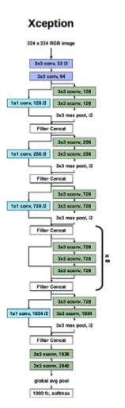

### Xception :

**Paper :** [Xception: Deep Learning with Depthwise Separable Convolutions](https://arxiv.org/pdf/1610.02357.pdf).

**Authors :** François Chollet. Google.

**Published in :** 2017 IEEE Conference on Computer Vision and Pattern Recognition (CVPR).

**Model Architecture :** 
<div align="center" >

</div>

**keras :**

```python
from keras.models import Model
from keras.layers.merge import concatenate
from keras.layers import Conv2D , MaxPool2D , SeparableConv2D , Input , GlobalAveragePooling2D , Dense , Dropout ,Activation , BatchNormalization

def conv_2d(prev_layer,nbr_filters , filter_size , strides , activation = False):
    x = Conv2D(filters = nbr_filters, kernel_size = filter_size, strides=strides , padding='same')(prev_layer)
    x = BatchNormalization(axis = 3) (x)
    if activation :
        x = Activation(activation = 'relu') (x)
    return x    

def sep_conv_2d(prev_layer,nbr_filters , filter_size , strides , activation = False):
    x = SeparableConv2D(filters = nbr_filters, kernel_size = filter_size, strides=strides ,padding='same')(prev_layer)
    x = BatchNormalization(axis = 3) (x)
    if activation :
        x = Activation(activation = 'relu') (x)
    return x

def ConvBlockA(prev_layer , nbr_filters, filter_size = (3,3), strides = (1,1)):
    
    branch1 = conv_2d(prev_layer = prev_layer,nbr_filters = nbr_filters, filter_size = (1,1), strides = (2,2))
    
    branch2 = sep_conv_2d(prev_layer = prev_layer, nbr_filters = nbr_filters, filter_size = filter_size, strides = strides , activation=True)
    branch2 = sep_conv_2d(prev_layer = branch2, nbr_filters = nbr_filters, filter_size = filter_size, strides = strides )
    branch2 = MaxPool2D(pool_size=(3,3) , strides=(2,2), padding='same') (branch2)
    
    output = concatenate([branch1 , branch2], axis = 3)
    
    return output

def ConvBlockB(prev_layer ):
    branch1 = prev_layer
    
    branch2 = sep_conv_2d(prev_layer = prev_layer, nbr_filters = 728, filter_size = (3,3), strides = (1,1) , activation=True)
    branch2 = sep_conv_2d(prev_layer = branch2, nbr_filters = 728, filter_size = (3,3), strides = (1,1), activation=True)
    branch2 = sep_conv_2d(prev_layer = branch2, nbr_filters = 728, filter_size = (3,3), strides = (1,1))
    
    output = concatenate([branch1 , branch2], axis = 3)
    
    return output

def ConvBlockC(prev_layer ):
    branch1 = conv_2d(prev_layer = prev_layer, nbr_filters = 1024, filter_size = (1,1), strides = (2,2))
    
    branch2 = sep_conv_2d(prev_layer, nbr_filters = 728, filter_size = (3,3), strides = (1,1) , activation = 'relu')    
    branch2 = sep_conv_2d(prev_layer = branch2, nbr_filters = 1024, filter_size = (3,3), strides = (1,1))
    branch2 = MaxPool2D(pool_size=(3,3) , strides=(2,2) , padding='same')(branch2)
    
    output = concatenate([branch1 , branch2], axis = 3)
    output = sep_conv_2d(prev_layer = output, nbr_filters = 1536, filter_size = (3,3), strides = (1,1) , activation=True)
    output = sep_conv_2d(prev_layer = output, nbr_filters = 2048, filter_size = (3,3), strides = (1,1) , activation=True)
    return output

def Xception():
    
    input_layer = Input(shape=(299 , 299 , 3))
    
    x = conv_2d(input_layer, nbr_filters = 32, filter_size = (3,3), strides = (2,2) , activation=True)
    x = conv_2d(x, nbr_filters = 64, filter_size = (3,3), strides = (1,1) , activation=True)
    
    x = ConvBlockA(prev_layer = x, nbr_filters = 128)
    x = ConvBlockA(prev_layer = x, nbr_filters = 256)
    x = ConvBlockA(prev_layer = x, nbr_filters = 728)
    
    x = ConvBlockB(prev_layer=x)
    x = ConvBlockB(prev_layer=x)
    x = ConvBlockB(prev_layer=x)
    x = ConvBlockB(prev_layer=x)
    x = ConvBlockB(prev_layer=x)
    x = ConvBlockB(prev_layer=x)
    x = ConvBlockB(prev_layer=x)
    x = ConvBlockB(prev_layer=x)
    
    x = ConvBlockC(prev_layer=x)

    x = GlobalAveragePooling2D()(x)
    x = Dense(units = 2048, activation='relu') (x)
    x = Dropout(rate = 0.5) (x)
    x = Dense(units = 1000, activation='softmax') (x)
    
    model = Model(inputs = input_layer, outputs = x , name = 'Xception')
    
    return model
```

**pyTorch :**

```python
import torch
import torch.nn as nn
import torch.nn.functional as F
from torchsummary import summary

class separableConv2D(nn.Module):
  def __init__(self , in_channels , out_channels , kernel_Size , activation , padding = 0 ):
    super(separableConv2D , self).__init__()
    
    self.depthwise = nn.Conv2d(in_channels= in_channels , out_channels = in_channels , kernel_size = kernel_Size , groups = in_channels ,stride = 1 , padding = padding )
    self.pointwise = nn.Conv2d(in_channels= in_channels , out_channels = out_channels , kernel_size = 1 )
    
    self.batchNormalization = nn.BatchNorm2d(num_features = out_channels)
    
    self.activation = nn.ReLU()
    self.act = activation
  def forward(self,x):
    out = self.depthwise(x)
    out = self.pointwise(out)
    out = self.batchNormalization(out)
    if self.act :
      out = self.activation(out)

    return out

class Conv_Block_A(nn.Module):
  def __init__(self , in_channels ,nbr_kernels):
    super(Conv_Block_A , self).__init__()
    self.branch1 = nn.Conv2d(in_channels= in_channels , out_channels = nbr_kernels , kernel_size = 1 , stride=2)
    
    self.branch2 = nn.Sequential(
        separableConv2D(in_channels = in_channels ,out_channels =  nbr_kernels , kernel_Size = 3  , activation = True) , 
        separableConv2D(in_channels = nbr_kernels ,out_channels =  nbr_kernels , kernel_Size = 3  , activation = False),
        nn.MaxPool2d(kernel_size=3 , stride = 2 , padding = 1)
    )

    self.activation = nn.ReLU()
  
  def forward(self , x):

    branch1 = self.branch1(x)
   
    branch2 = self.activation(x)
    branch2 = self.branch2(branch2)

    out = torch.cat([branch1 , branch2 ], 1)
    
    return out

class Conv_Block_B(nn.Module):
  def __init__(self,in_channels):
    super(Conv_Block_B , self).__init__()
    self.branch1 = nn.Sequential(
        separableConv2D(in_channels = in_channels ,out_channels =  728 , kernel_Size = 3  , activation = True) ,
        separableConv2D(in_channels = 728 ,out_channels =  728 , kernel_Size = 3  , activation = True),
        separableConv2D(in_channels = 728 ,out_channels =  728 , kernel_Size = 3  , activation = False) 
    )
    self.activation = nn.ReLU()

  def forward(self , x):
    branch1 = self.activation(x)
    branch1 = self.branch1(branch1)

    branch2 = x 

    out = torch.cat([branch1 , branch2] , 1)
    
    return out

class Conv_Block_C(nn.Module):
  def __init__(self,in_channels):
    super(Conv_Block_C , self).__init__()

    self.branch1 = nn.Sequential(
        separableConv2D(in_channels = in_channels ,out_channels =  728 , kernel_Size = 3  , activation = True) ,
        separableConv2D(in_channels = 728 ,out_channels =  1024 , kernel_Size = 3  , activation = False) ,
        nn.MaxPool2d(kernel_size=3 , stride = 2 , padding = 1)
    )

    self.branch2 = nn.Conv2d(in_channels=in_channels , out_channels = 1024 , kernel_size = 1 , stride = 2 )

    self.sepconv1 = separableConv2D(in_channels = 2048 ,out_channels =  1536 , kernel_Size = 3  , activation = True)
    self.sepconv1 = separableConv2D(in_channels = 1536 ,out_channels =  2048 , kernel_Size = 3  , activation = True)
    self.activation = nn.ReLU()
 
  def forward(self , x):
   branch1 = self.activation(x)
   branch1 = self.branch1(branch1)

   branch2 = self.branch2(x)

   out = torch.cat([branch1 , branch2] , 1)

   out = self.sepconv1(out)
   out = self.sepconv2(out)

   return out

class Xception(nn.Module):
  def __init__(self):
    super(Xception , self).__init__()

    self.conv1 = nn.Conv2d(in_channels= 3 , out_channels=32 , kernel_size=3 , stride = 2)
    self.conv2 = nn.Conv2d(in_channels= 32 , out_channels=64 , kernel_size=3)

    self.convBlock_A_1 = Conv_Block_A(32 , 128)
    self.convBlock_A_2 = Conv_Block_A(128 , 256)
    self.convBlock_A_3 = Conv_Block_A(256 , 728)

    self.convBlock_B_1   = Conv_Block_B(728)
    self.convBlock_B_2   = Conv_Block_B(1536)

    self.convBlock_C   = Conv_Block_B(1536)

    self.fc1 = nn.Linear(in_features=2048 , out_features= 2048 )
    self.fc2 = nn.Linear(in_features=2048 , out_features= 1000 )
  
  def forward(self , x):

    out = self.conv1(x)
    print('After Conv1 : ' , out.shape)
    out = self.conv2(out)
    print('After Conv2 : ' , out.shape)

    out = self.convBlock_A_1(out)
    print('After Block A_1 : ',out.shape)
    out = self.convBlock_A_2(out)
    print('After Block A_2 : ',out.shape)
    out = self.convBlock_A_3(out)
    print('After Block A_3 : ',out.shape)

    out = self.convBlock_B_1(out)
    out = self.convBlock_B_2(out)
    out = self.convBlock_B_2(out)
    out = self.convBlock_B_2(out)
    out = self.convBlock_B_2(out)
    out = self.convBlock_B_2(out)
    out = self.convBlock_B_2(out)
    out = self.convBlock_B_2(out)
    print('After Block B : ',out.shape)
    out = self.convBlock_C(out)
    print('After Block C : ',out.shape)

    out = self.fc1(out)
    out = nn.ReLU()(out)

    out = self.fc2(out)
    out = nn.Softmax()(out)
    
    return out

model = Xception()

summary(model , (3 , 299 , 299))
```